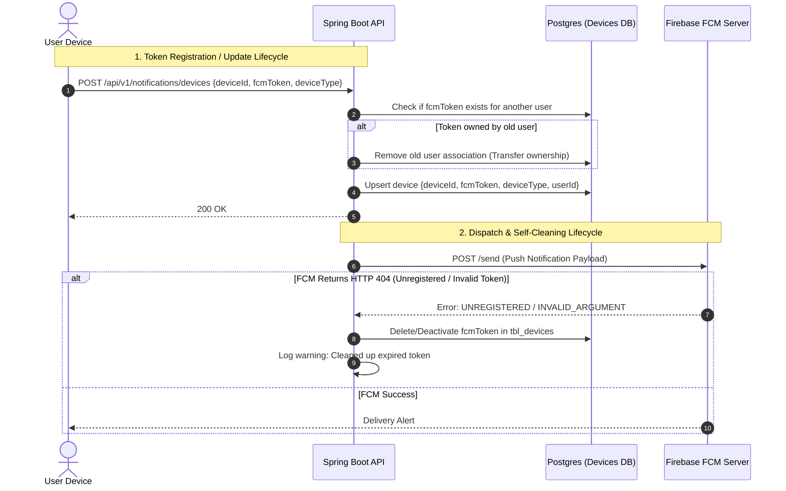

# ADR-0004: Polymorphic and Extensible Notification Dispatching Module

## Status
Accepted

## Date
2026-07-10

## Context
The **Liga dos Palpites** application needs to communicate with users through various notification channels, such as:
1. **In-App Notifications**: Stored in a database feed accessible via a bell icon.
2. **Mobile Push Notifications**: Real-time popups sent to iOS/Android devices using Firebase Cloud Messaging (FCM).
3. **Email**: For receipt confirmations, weekly digests, and account recovery.
4. **Future Channels**: Possible future expansion to SMS or WhatsApp alerts.

Tightly coupling the application business logic to concrete notification providers (such as the Firebase SDK or an email client) causes major drawbacks:
- **High Maintenance**: Swapping or adding vendors requires editing use cases.
- **Testing Hurdles**: Writing integration tests becomes difficult as mock classes must mimic specific SDK behaviors.
- **Token Pollution**: Devices frequently change tokens (app reinstall, OS updates, device transfer). Failing to update or prune invalid tokens leads to duplicate alerts, security issues, and wasteful API charges.

We need a flexible, decoupled, and self-cleaning notification delivery architecture.

## Decision
We will implement an extensible notification module using the **Strategy Pattern** (Ports & Adapters) inside the `notifications` bounded context, paired with a dynamic registration, update, and self-cleaning lifecycle for device tokens.



### 1. Delivery Abstraction (Strategy Pattern)
The core of the `notifications` module will only know about the `Notification` domain aggregate and the `NotificationSender` port:

* **Notification Entity**: Holds fields like `recipientUserId`, `title`, `content`, `category` (GOAL, RANKING, BILLING, SYSTEM), and creation timestamps.
* **NotificationChannel** (Enum): `IN_APP`, `PUSH`, `EMAIL`, `SMS`.
* **Sender Interface (Port)**:
  ```kotlin
  interface NotificationSender {
      fun supports(channel: NotificationChannel): Boolean
      fun send(notification: Notification, recipient: RecipientContactInfo)
  }
  ```
* **Specific Senders (Adapters)**:
  - `InAppNotificationSender`: Inserts records into PostgreSQL `tbl_in_app_notifications`.
  - `FcmPushNotificationSender`: Integrates with Firebase Admin SDK to push to FCM.
  - `SmtpEmailNotificationSender`: Integrates with JavaMail/SendGrid to send emails.

### 2. Device Token & Email Lifecycle Management

#### A. Initial Registration
- **FCM Device Token**: The mobile app fetches its active FCM token from the device OS and calls `POST /api/v1/notifications/devices` at launch or authentication. The request payload contains:
  - `deviceId`: A UUID generated locally by the app (survives updates, reset on app reinstall).
  - `fcmToken`: The dynamic string token from FCM.
  - `deviceType`: `IOS` or `ANDROID`.
- **Email**: Synced automatically from the Firebase Authentication JWT claims during the user's first login and stored in `tbl_users.email`.

#### B. Maintenance & Token Refresh
- **Token Update**: The mobile client listens for FCM token refreshes. If the token changes, or on every fresh app start/login, the client posts the active token to `POST /api/v1/notifications/devices`.
- **Ownership Transfer**: If Token X is registered to User B, but the database shows it was previously linked to User A (e.g., User A logged out and User B logged in on the same device), the system automatically deletes the link from User A and upserts the token linked to User B.

#### C. Invalid Token Cleanup (Self-Cleaning)
- When `FcmPushNotificationSender` sends a batch of push notifications and receives an error indicating the token is no longer valid (FCM errors like `UNREGISTERED` or `INVALID_ARGUMENT`):
  - The adapter publishes a `DeviceTokenExpiredEvent` containing the invalid `fcmToken`.
  - An internal transaction listener captures this event and immediately deletes the invalid token from `tbl_devices` to prevent subsequent wasteful calls.

### 3. Asynchronous Sending Patterns
- **Non-Blocking Execution**: Other modules (e.g., `predictions`, `billing`) trigger notifications exclusively by publishing domain events (such as `PredictionsProcessedEvent`). The `notifications` module listens to these events asynchronously.
- **User Preference Enforcement**: Before dispatching, the orchestrator queries `tbl_user_notification_preferences` to ensure the user has not muted that specific category on that channel.

## Consequences

### Positive (Benefits)
* **High Extensibility**: Adding a new channel (e.g., WhatsApp) only requires writing a new class implementing `NotificationSender` and adding a new enum value.
* **Low Cost & High Quality**: Keeping FCM tokens clean prevents cloud charges/latencies from trying to push to dead devices.
* **Decoupled Architecture**: Business modules do not know or care how notifications are delivered.

### Negative (Trade-offs)
* **API Overhead**: The mobile client must call the device token registration API on every application startup, resulting in minor write traffic on `tbl_devices`.
* **Latency**: Resolving user contact preferences and active device tokens adds a minor latency before the delivery API is hit (mitigated by caching active tokens in Redis).
