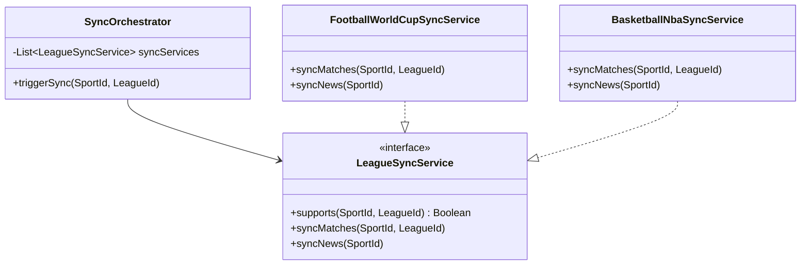

# ADR-0006: Polymorphic Sports Ingestion & Tournament Engine

## Status
Accepted

## Date
2026-07-10

## Context
The legacy application was hardcoded to only support the **FIFA World Cup** tournament. All logic—including the background Node.js scripts (`news_sync.js`, `scheduler.js`), database collections in Firestore, prediction scoring (e.g., exact score = 25 points), and knockout bracket advancements—was tightly coupled to this single tournament.

The V2 application aims to be a **Multi-Sport Hub** (aggregating Football, Basketball, American Football, etc.) where each sport and league can have:
1. Different external API providers (e.g., API-Football, API-Sports, or NBA APIs).
2. Distinct scoring rules for predictions (e.g., standard soccer goals vs. basketball point margin).
3. Custom tournament formats (Round-robin tables, play-offs, or bracket knockouts).

Maintaining the hardcoded structures violates the Open/Closed Principle (OCP) and makes scaling to new sports impossible. Furthermore, as the mobile application transitions from V1 to V2, the new backend must maintain backwards compatibility, serving existing features without breaking legacy clients.

## Decision
We will implement a polymorphic, metadata-driven architecture for sports data ingestion, predictions scoring, and tournament bracket resolution.



### 1. Ingestion Strategy (Strategy Pattern)
Instead of a single scheduler script, we will define a generic interface for synchronizations:
- **`LeagueSyncService` Port**:
  ```kotlin
  interface LeagueSyncService {
      fun supports(sportId: SportId, leagueId: LeagueId): Boolean
      fun syncMatches(sportId: SportId, leagueId: LeagueId)
      fun syncNews(sportId: SportId)
  }
  ```
- **Sync Orchestrator**: The backend exposes internal HTTP routes parameterized with `sportId` and `leagueId` (e.g. `POST /api/v1/internal/scheduler/process?sportId=...&leagueId=...`). The orchestrator receives the call, scans registered Beans to find the service that `supports(...)` the request, and delegates the execution.
- **World Cup Ingestion**: The first concrete implementation will be `FootballWorldCupSyncService`, which encapsulates the ported Node.js logic:
  - Connects to API-Sports for World Cup fixtures.
  - Maps API rounds to tournament stages (`group`, `roundOf16`, `quarterFinals`, `semiFinals`, `thirdPlace`, `finalMatch`).
  - Resolves team names translation (English to Portuguese) and bracket placeholders.

### 2. Extensible Predictions Scoring Engine
Predictions scoring rules are dynamic and configurations are loaded per league:
- **ScoringRules VO**: Contains point values for exact matches, correct winner, goal difference, and bonuses.
- **Polymorphic Scoring**: The scoring engine evaluates predictions using the rules loaded from `tbl_groups.scoring_rules_json` or the parent league's parameters, allowing different sports (or even different groups inside the same league) to run custom point weights.

### 3. Standings & Bracket Advancement Engine
The sync service coordinates tournament transitions:
1. **Kickoff Prediction Lock**: The engine checks upcoming matches. When `now >= kickoffTime`, the match status transitions to `inProgress`, locking predictions in the database.
2. **Team Standings Aggregation**: For group stages, completing a match triggers automatic local updates to `tbl_group_members` and a standings statistics table in PostgreSQL.
3. **Knockout Bracket Resolution**: 
   - When a group finishes (all teams played 3 matches), the engine sorts standings and replaces team placeholders (e.g. `1º Grupo A`, `2º Grupo B`) with the actual country names.
   - When a knockout match completes, the engine detects its winner and advances them by replacing the placeholder in the next bracket match (e.g. replacing `Vencedor Jogo 74` with the country name).

### 4. Backwards Compatibility & Route Mapping
To support the legacy Flutter V1 application, the backend API Gateway / Controllers will expose compatibility endpoints. If V1 requests data in the old Firestore schema format, a translation layer in the backend controllers will map the PostgreSQL relational records into the V1 JSON model, preventing client crashes during the migration.

## Consequences

### Positive (Benefits)
* **High Modularity**: Adding a new sport (e.g. Basketball NBA) is as simple as adding a new class `BasketballNbaSyncService` and implementing its specific API mapper and rules.
* **Flexible Tournament Configs**: Leagues can easily have completely different formats (e.g. simple round-robin tables vs complex bracket systems).
* **Safe V2 Rollout**: Legacy clients can still query and make predictions without breaking existing active users.

### Negative (Trade-offs)
* **Metadata Overhead**: Requires maintaining tables for name normalization mapping (English names from sports APIs to localized names).
* **Increased System Complexity**: Introducing polymorphism requires more rigorous unit testing to prevent regressions in bracket calculations.
