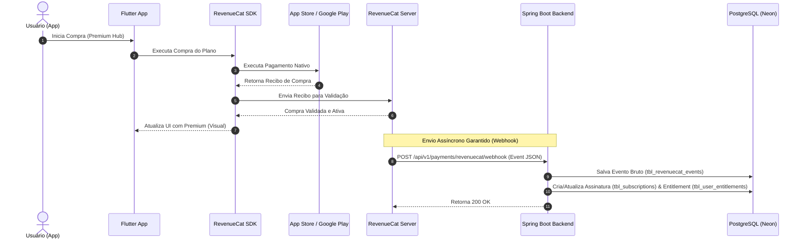

# ADR-0009: Integração de Monetização Orientada a Webhooks via RevenueCat

## Status
`Accepted`

## Contexto
A plataforma **Liga dos Palpites** precisa rentabilizar sua operação por meio de compras no aplicativo (In-App Purchases - IAP) e assinaturas auto-renováveis nas lojas **Apple App Store** (iOS) e **Google Play Store** (Android), oferecendo os planos **Sport Pass** e **Premium Hub**.

Integrar de forma nativa e direta com as APIs de validação de recibos de cada loja (Apple App Store Server API e Google Play Developer API) traz alta complexidade técnica e de manutenção, incluindo:
1. Criação e assinatura criptográfica de chaves de autenticação de servidores.
2. Gerenciamento complexo do estado de assinaturas (renovações, cancelamentos, estornos, períodos de graça, falhas de cobrança).
3. Monitoramento de webhooks específicos de cada plataforma (Apple Server Notifications V2 e Google RTDN via Google Cloud Pub/Sub).

Para acelerar o desenvolvimento de forma segura e confiável, decidimos utilizar o **RevenueCat** como middleware/motor de faturamento unificado para o aplicativo Flutter e backend Spring Boot.

---

## Decisões Arquiteturais e Regras de Negócio

### 1. Seleção do RevenueCat como Abstração de Pagamentos
Decidimos delegar a validação de compras, cálculo de expirações e gerenciamento de assinaturas nativas ao RevenueCat. 
- **Benefício Financeiro**: Gratuito até atingir US$ 10.000 de receita bruta mensal, o que cobre perfeitamente a fase inicial do projeto.
- **Benefício Técnico**: O Flutter utiliza um único SDK unificado (`purchases_flutter`) e o backend Spring Boot consome uma API REST e webhook única e independente de plataforma.

---

### 2. Fluxo de Faturamento Orientado a Webhook (Server-Side SOT)
Embora o SDK do RevenueCat no Flutter forneça o estado de assinaturas ativo localmente para agilizar mudanças cosméticas de UI, **o backend Spring Boot é a única Fonte da Verdade (Source of Truth)** para o processamento de regras de negócios e liberação de dados protegidos.
- Quando o usuário compra algo no app Flutter, o app interage com o SDK do RevenueCat.
- O RevenueCat processa a compra junto às lojas nativas e dispara um **Webhook assíncrono** com garantia de entrega (at least once) diretamente para o backend Spring Boot.
- O Spring Boot processa o webhook e atualiza o banco de dados PostgreSQL (`tbl_user_entitlements` e `tbl_subscriptions`).

---

### 3. Armazenamento de Eventos Brutos para Idempotência e Auditoria
Para prevenir falhas catastróficas em cenários de instabilidade na rede ou inconsistência nas lojas, adotamos duas premissas rígidas:
- **Tabela de Log de Eventos (`tbl_revenuecat_events`)**: Todo JSON recebido no webhook é persistido imediatamente no banco de dados com seu respectivo ID de evento enviado pelo RevenueCat antes de qualquer processamento lógico de negócios.
- **Idempotência**: Antes de processar um evento, o backend verifica se o `event_id` já existe na tabela de logs. Se existir, ignora o processamento de regras de negócio adicionais e retorna `200 OK` imediatamente. Isso resolve o problema de entregas duplicadas (duplication delivery) nativo do protocolo do RevenueCat.

---

### 4. Segurança do Endpoint de Webhook (Sem JWT, Token Estático)
Como o endpoint do webhook é consumido por servidores do RevenueCat e não por um usuário logado no aplicativo:
- O endpoint `/api/v1/payments/revenuecat/webhook` será excluído dos filtros de validação JWT do Firebase Auth no Spring Security.
- Proteção será realizada via cabeçalho personalizado customizado (exemplo: `Authorization: Bearer <WEBHOOK_SECRET>`). O backend validará a assinatura/segredo estático contido nas variáveis de ambiente seguras do servidor.

---

### 5. Sincronismo de Entitlements no Banco de Dados
A tabela `tbl_user_entitlements` será atualizada mapeando os IDs de entitlements do RevenueCat para os tipos locais (`PREMIUM` ou `SPORT_PASS` com seu respectivo `sport_id`).
- Eventos de ativação (`INITIAL_PURCHASE`, `RENEWAL`, `UNCANCELLATION`) estendem ou reativam o `expires_at` do respectivo direito.
- Eventos de cancelamento (`CANCELLATION`) apenas marcam o estado do log da assinatura como cancelada, mas não removem o direito do usuário imediatamente. O acesso do usuário continuará ativo até que a data de término do período contratado (`expires_at`) seja ultrapassada.
- Eventos de expiração (`EXPIRATION`) atualizam o `expires_at` do direito de acesso de forma a bloqueá-lo imediatamente.

---

## Consequências
- **Positivas**:
  - Redução drástica de tempo de desenvolvimento (de meses para dias).
  - Um único fluxo de validação e controle para iOS e Android.
  - Resiliência técnica por meio de log bruto e idempotência.
  - Redução de custos operacionais (Free Tier do RevenueCat).
- **Negativas**:
  - Dependência de terceiros (RevenueCat) para a tradução inicial de eventos das lojas.
