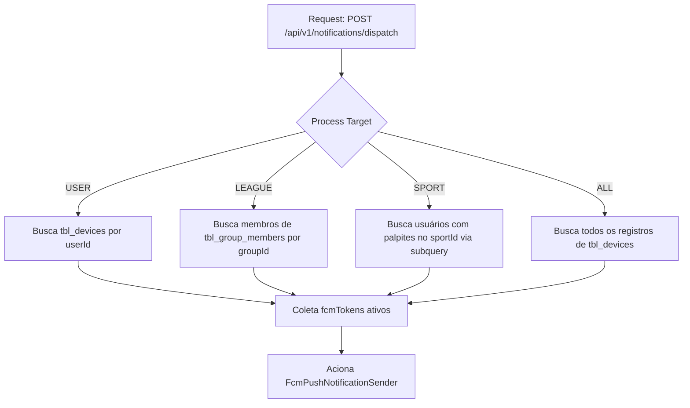

# ADR-0010: Extensible Notification Dispatching and Targeting Engine

## Status
`Accepted`

## Date
2026-07-19

## Contexto
O ecossistema do **Liga dos Palpites** já possui adaptadores base de envio polimórfico de notificações (`FcmPushNotificationSender`, `InAppNotificationSender`, `SmtpEmailNotificationSender`), conforme definido na [ADR-0004](0004-extensible-notification-delivery.md). No entanto, não havia até então:
1. Um orquestrador/despachante (`NotificationDispatcherService`) responsável por coordenar a seleção dos canais adequados de envio de acordo com as preferências e dispositivos do destinatário.
2. Um mecanismo estruturado para realizar o disparo direcionado (Targeting) para públicos específicos de usuários, tais como:
   - **Usuário Individual (`USER`)**: Disparar diretamente para todos os dispositivos de um usuário específico.
   - **Membros de uma Liga/Grupo (`LEAGUE`)**: Notificar todos os participantes ativos de um grupo de competição (`tbl_group_members`).
   - **Interessados em um Esporte (`SPORT`)**: Enviar alertas personalizados para usuários que realizaram palpites em partidas daquele esporte (`tbl_predictions` integrado com `tbl_matches`).
   - **Todos os Usuários (`ALL`)**: Transmissão em massa (broadcast) para todas as pessoas com dispositivos registrados no banco (`tbl_devices`).

Para tornar a funcionalidade de notificações 100% ativa, confiável e flexível, é necessária uma decisão de design que unifique a estratégia de segmentação de destinatários e exponha uma interface de despacho administrativo segura.

---

## Decisões Arquiteturais e Regras de Negócio

### 1. Criação do NotificationDispatcherService (Orquestrador)
Implementaremos um serviço centralizador encarregado de buscar os tokens dos usuários elegíveis com base no público-alvo (Target) selecionado e acionar as estratégias de envio (`NotificationSender`) que correspondam aos canais solicitados (por padrão, `PUSH` e/ou `IN_APP`).

### 2. Segmentação de Destinatários (Targeting Strategy)
O payload aceitará um campo de segmentação `target` (tipo Enum) e um `targetId` opcional, processados da seguinte forma:



* **`USER`**: Busca na tabela `tbl_devices` por entradas onde `user_id = targetId`.
* **`LEAGUE`**: Busca todos os membros ativos na tabela `tbl_group_members` onde `group_id = targetId`. Coleta os tokens associados aos respectivos `user_id` encontrados.
* **`SPORT`**: Realiza uma busca nos palpites dos usuários em `tbl_predictions` que correspondam a partidas em `tbl_matches` associadas ao `sport_id = targetId`. Coleta os tokens associados aos respectivos `user_id`.
* **`ALL`**: Coleta todos os tokens FCM de `tbl_devices` sem filtros adicionais.

---

### 3. REST API de Despacho Seguro
Criaremos o endpoint `POST /api/v1/notifications/dispatch` com o seguinte payload:
```json
{
  "target": "USER",
  "targetId": "255bdfa4-ae3c-489c-8b14-c823c5fce453",
  "title": "⚽ GOOOL!",
  "content": "Tem gol do seu time!",
  "channels": ["PUSH", "IN_APP"]
}
```

* **Segurança Administrativa**: Como o envio em lote pode acarretar custos operacionais e problemas de SPAM para os usuários, este endpoint será restrito temporariamente a chamadas administrativas autorizadas. Validaremos a presença do cabeçalho `X-Admin-Secret` mapeado a uma chave estática segura nas variáveis de ambiente.

---

## Consequências

### Positivas
* **Funcionalidade Unificada**: Resolve o gap de envio de notificações, tornando o subsistema de push 100% funcional.
* **Segmentação Rápida**: Suporta múltiplos targets (Individual, Liga, Esporte, Todos) de forma otimizada usando consultas nativas ou subqueries do JPA.
* **Flexibilidade de Canais**: Permite decidir dinamicamente se o envio será apenas Push, In-App ou ambos através da lista de `channels`.

### Negativas
* **Custo de Busca em Lote (`ALL`)**: Para milhares de dispositivos registrados, a busca em massa e despacho síncrono pode causar timeout HTTP.
  * *Mitigação*: O processo de envio para múltiplos destinatários fará o despacho de forma assíncrona usando threads em segundo plano do Spring `@Async`, retornando a resposta imediatamente para o cliente HTTP.
