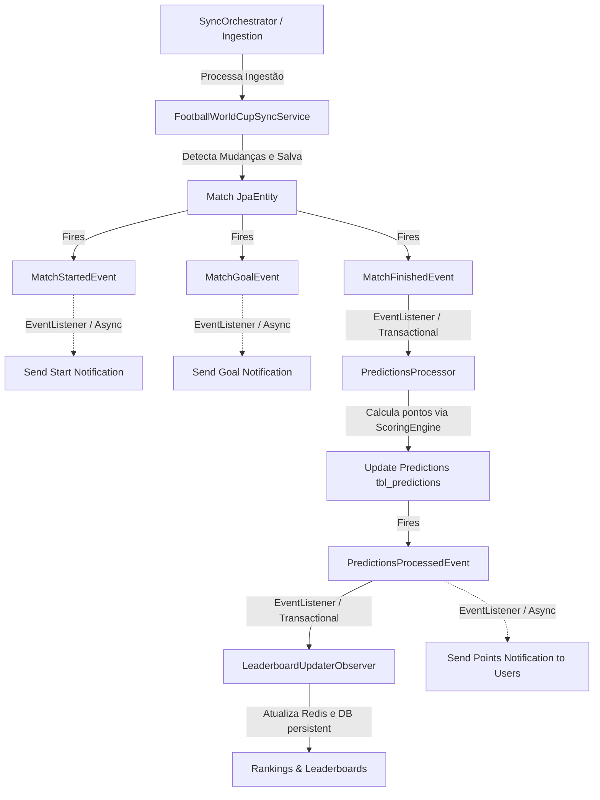

# ADR-0011: Automated Event-Driven Push Notifications

## Context

A plataforma **Liga dos Palpites** necessita enviar atualizações dinâmicas e reativas em tempo real para os usuários do aplicativo móvel à medida que eventos esportivos ocorrem. Exemplos críticos de engajamento do usuário incluem:
1. **Início de Partida**: Notificar que um jogo no qual o usuário deu palpite começou.
2. **Gols Marcados**: Notificar atualizações em tempo real do placar de uma partida.
3. **Fim de Partida**: Notificar o encerramento do jogo, processar palpites/pontos e informar ao usuário quantos pontos ele ganhou com seu palpite.

O processamento e cálculo de palpites (`ScoringEngine.kt`) e a atualização dos rankings (`LeaderboardUpdaterObserver.kt`) foram definidos no escopo de modelos de domínio, porém não estavam conectados reativamente ao processo de sincronização de partidas (`FootballWorldCupSyncService`).

Precisamos estruturar um padrão robusto, desacoplado e resiliente baseado em eventos para:
- Detectar alterações de status e gols no fluxo de ingestão (`SyncOrchestrator`).
- Calcular pontos e atualizar o leaderboard de forma transacional e confiável.
- Enviar as notificações segmentadas associadas a esses eventos, sem impactar o desempenho da requisição HTTP ou do cron de sincronização.

## Proposed Decision

Decidimos adotar um design **orientado a eventos** (Event-Driven Architecture) utilizando o mecanismo interno de publicação de eventos do Spring (`ApplicationEventPublisher`) e ouvintes assíncronos (`@EventListener` / `@Async`) para desacoplar as camadas de sincronização esportiva, cálculo de pontos e envio de notificações push.

### Detecção de Eventos (Camada de Sincronização)
Durante a ingestão inteligente de dados em `performUpsert` dentro de `FootballWorldCupSyncService`, comparamos cada partida externa com seu registro atual na base de dados para detectar as transições de estado:
1. **Partida Iniciada**: Estado anterior era `SCHEDULED` e o novo estado é `LIVE`.
   - Dispara `MatchStartedEvent`.
2. **Gol Marcado**: Estado é `LIVE`, e a pontuação (`homeScore` ou `awayScore`) mudou.
   - Dispara `MatchGoalEvent`.
3. **Partida Encerrada**: Estado anterior era `LIVE` (ou `SCHEDULED`) e o novo estado é `FINISHED`.
   - Dispara `MatchFinishedEvent`.

### Desacoplamento do Processamento de Pontos
* Um componente `PredictionsProcessorService` escutará reativamente o `MatchFinishedEvent`.
* Ele processará todas as previsões pendentes (`isProcessed = false`) para aquela partida específica usando o `ScoringEngine`.
* Atualizará a pontuação ganha de cada usuário no banco de dados e marcará as previsões como processadas (`isProcessed = true`).
* Publicará um `PredictionsProcessedEvent`, permitindo que os rankings de classificação no Redis (Upstash) e no PostgreSQL sejam atualizados pelo observador existente `LeaderboardUpdaterObserver`.

### Envio Reativo de Notificações
* Os serviços de notificação serão ouvintes (`@EventListener`) anotados com `@Async` para garantir que o envio do push (que depende de APIs externas do FCM) não bloqueie a persistência ou a transação principal de sincronização de partidas:
  - **Início de Partida**: Dispara notificações push aos usuários que realizaram palpites na partida usando a infraestrutura do `NotificationDispatcherService`.
  - **Gols Marcados**: Envia notificações do placar atualizado.
  - **Fim de Jogo**: Aguarda a conclusão do processamento de palpites e envia notificações direcionadas para cada usuário participante informando os pontos específicos adquiridos.

## Status

`Accepted`

## Consequences

* **Acoplamento Mínimo**: A camada de ingestão de feeds esportivos apenas publica eventos que refletem a realidade de campo, desconhecendo completamente regras de cálculo de palpites e canais de notificação.
* **Consistência Eventual**: O processamento de palpites e atualização de leaderboards é transacional e roda reativamente após o término do jogo, garantindo integridade dos dados operacionais e de classificação.
* **Resiliência de Envio**: Erros ou lentidões no barramento de push da Google (FCM) não afetam a escrita no banco de dados nem a sincronização de outras partidas.
