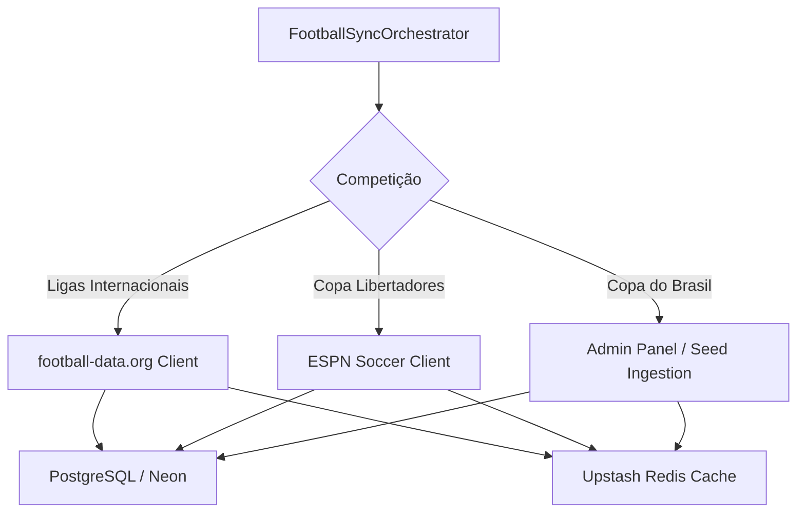

# ADR-0012: Football Multi-League & Tournament Data Strategy

## Status
Accepted

## Date
2026-07-30

## Context

A modalidade de **Futebol** é o esporte âncora da plataforma **Liga dos Palpites**. Com o plano de expansão para múltiplas ligas nacionais e internacionais (Brasileirão Série A, Champions League, La Liga, Premier League, Ligue 1, Bundesliga, Serie A Italiana, Eredivisie, Primeira Liga Portuguesa, Championship e Eurocopa), precisávamos garantir a sincronização de fixtures, tabelas e placares sem gerar custos operacionais.

Além disso, a **Copa Libertadores** exigia suporte aos clubes sul-americanos sem restrição de paywalls da API-Sports, enquanto a **Copa do Brasil** precisava de uma alternativa estável para torneio mata-mata nacional.

## Decision

Decidimos adotar uma estratégia híbrida focada em **Custo Zero** para a ingestão de dados de futebol:

1. **Ligas Globais e Nacionais (football-data.org)**:
   - Ingestão via API v4 da **football-data.org** para 11 ligas suportadas no plano Free (`BSA`, `PL`, `PD`, `CL`, `FL1`, `BL1`, `SA`, `DED`, `PPL`, `ELC`, `EC`).
   - Cota de 10 req/min gerida por cache local com TTL de 24h para calendários.

2. **Copa Libertadores (ESPN Public API)**:
   - Ingestão via endpoint público `site.api.espn.com/apis/site/v2/sports/soccer/conmebol.libertadores/scoreboard`.
   - Cobertura completa de fases de grupo e mata-mata com logos HD.

3. **Copa do Brasil (Painel Admin & Ingestão por Seed)**:
   - Ingestão de fases eliminatórias (da 3ª fase à final) gerenciada pelo **Painel Admin do backend** ou via Seed SQL para manter a operação sem custos.

## Consequences

### Positive
* **Custo Zero Mantido**: Cobertura das 13 principais ligas de futebol do mundo sem custo mensal.
* **Resiliência**: Circuit Breaker no Spring Boot com fallback automático se a API principal falhar.

### Negative
* **Normalização de Nomes**: Requer dicionário de tradução de nomes de clubes (`teamNameTranslations`) para padronização em português.
