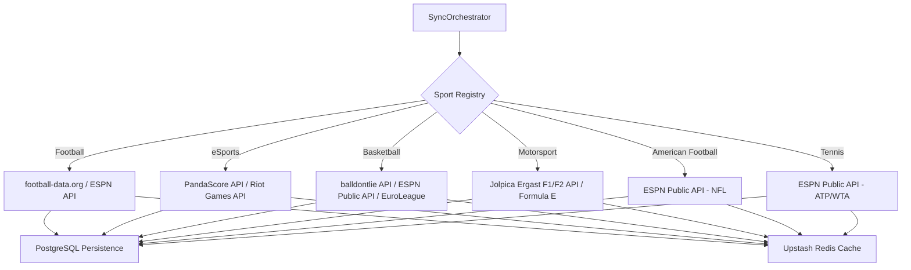

# ADR-0012: Zero-Cost Multi-Sport API Integration Strategy

## Status
Accepted

## Date
2026-07-30

## Context

Com o avanço do ecossistema **Liga dos Palpites** para um Hub Multi-Esportivo cobrindo **Futebol, eSports, Basquete, Motorsport, Futebol Americano e Tênis**, a seleção de fontes externas de dados tornou-se crítica. 

Algumas APIs comerciais de esportes (como a API-Basketball/API-Sports) impõem paywalls agressivos que bloqueiam o acesso a jogos da temporada atual no plano gratuito. Como o projeto opera sob a premissa arquitetural de **Custo Zero de Infraestrutura** (**[ADR-0002](file:///c:/Users/Vinicius/workspace/ligadospalpites-core/docs/adr/0002-cloud-deployment-free-tier.md)**), precisávamos estabelecer uma estratégia unificada e resiliente para integrar múltiplos provedores sem custos de licença, garantindo a exibição de partidas ativas, calendários e placares ao vivo.

## Decision

Decidimos adotar uma **Estratégia Polymorphic Multi-Provider** desacoplada por esporte (estendendo a **[ADR-0006](file:///c:/Users/Vinicius/workspace/ligadospalpites-core/docs/adr/0006-sports-data-sync-engine.md)**), priorizando APIs abertas de alto desempenho e endpoints REST públicos com cache inteligente:

### 1. Seleção de Provedores por Esporte

1. **Futebol & Sul-Americano**:
   - **football-data.org**: Ingestão de ligas internacionais (Brasileirão, Champions League, La Liga, Premier League, Ligue 1, Bundesliga, Serie A, Eredivisie, Primeira Liga, Championship).
   - **ESPN Public API (`conmebol.libertadores`)**: Ingestão gratuita da Copa Libertadores (jogos atuais, datas e logos HD).
   - **Admin Panel / Seed SQL**: Ingestão gerenciada de fases eliminatórias da Copa do Brasil.

2. **eSports (LoL, CS2, Valorant, Dota 2)**:
   - **PandaScore API (Pro Provider)**: Ingestão de torneios profissionais (CBLOL, VCT Americas, CS2 Majors, Worlds), partidas em séries (MD1, MD3, MD5) e escudos das equipes.
   - **Riot Games API (User Profiling)**: Vinculação opcional de invocadores e sincronização de Elo/Rank dos usuários no app.

3. **Basquete (NBA, NBB, EuroLeague, WNBA)**:
   - **balldontlie.io API + ESPN Public API (`basketball/nba` e `wnba`)**: Partidas da temporada atual da NBA/WNBA sem bloqueios, placares por quarto e logos PNG 500x500.
   - **EuroLeague JSON API (`live.euroleague.net`)**: Ingestão de jogos e classificação da EuroLeague/EuroCup.
   - **LNB Portal JSON / Admin**: Ingestão da tabela do NBB Brasil.

4. **Motorsport / Automobilismo (F1, F2, FE, Stock Car)**:
   - **Jolpica Ergast API (`api.jolpi.ca/ergast/`) + OpenF1**: Ingestão de F1 e F2 (GPs, Qualifying, Sprint e Classificação de Pilotos/Construtores).
   - **Formula E API & Stock Car Brasil API/Seed**: Ingestão de Eprix e etapas da Stock Car Pro Series.

5. **Futebol Americano (NFL & College)**:
   - **ESPN Public API (`football/nfl` e `college-football`)**: Jogos da NFL, pontuação por quarto (Q1-Q4, OT) e logos das 32 franquias.

6. **Tênis (ATP Tour, WTA Tour, Grand Slams)**:
   - **ESPN Public API (`tennis/atp` e `wta`)**: Torneios, sementes, confrontos e parcial de sets (MD3 e MD5).

### 2. Padrões de Resiliência e Cache (Upstash Redis + Resilience4j)

* **Resilience4j Circuit Breaker**: Todos os clientes HTTP externos (`EspnClient`, `PandaScoreClient`, `ErgastClient`, `FootballDataClient`) são anotados com `@CircuitBreaker` e `@Retry`.
* **Estratégia de Cache local Redis**:
  - *Calendários e Ligas (Fixtures futuras)*: TTL de 24h.
  - *Partidas ao vivo (Live Scores)*: TTL de 30s a 60s para respeitar limites sem sobrecarregar endpoints públicos.

## Consequences

### Positive (Benefits)
* **Custo Zero Mantido**: Elimina a dependência de planos pagos de APIs de terceiros.
* **Sem Bloqueios de Temporada**: Permite exibir jogos da temporada atual de NBA, Libertadores e NFL sem restrições.
* **Alta Escalabilidade Polimórfica**: Cada novo esporte é adicionado como uma nova implementação de `LeagueSyncService` seguindo a **[ADR-0006](file:///c:/Users/Vinicius/workspace/ligadospalpites-core/docs/adr/0006-sports-data-sync-engine.md)**.

### Negative (Trade-offs)
* **Manutenção de Adaptores**: Exige a manutenção de clientes DTO específicos para mappers da ESPN, Jolpica e PandaScore.
* **Monitoramento de Endpoints Públicos**: Requer log de fallback para caso algum endpoint não-oficial altere o payload JSON.
