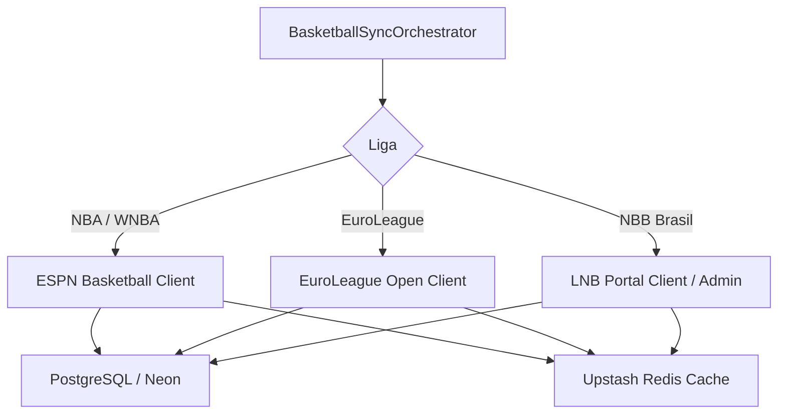

# ADR-0013: Basketball Integration & Free Data Strategy

## Status
Accepted

## Date
2026-07-30

## Context

O plano gratuito da API-Basketball (API-Sports) bloqueia requisições para a temporada atual (*current season*), exibindo paywalls para a NBA, NBB e EuroLeague. Como a plataforma opera sob premissa de custo zero (**[ADR-0002](file:///c:/Users/Vinicius/workspace/ligadospalpites-core/docs/adr/0002-cloud-deployment-free-tier.md)**), foi necessário estabelecer uma fonte alternativa livre para basquete.

## Decision

Decidimos integrar uma estratégia de dados de basquete 100% livre baseada em 3 pilares:

1. **NBA, WNBA e NCAA (ESPN Public API + balldontlie.io)**:
   - Utilização da **API Pública da ESPN** (`site.api.espn.com/apis/site/v2/sports/basketball/nba/scoreboard`) e da **balldontlie.io API**.
   - Acesso ilimitado a jogos da temporada atual, datas, parciais de pontos por quarto (Q1, Q2, Q3, Q4, OT) e logos 500x500 PNG.

2. **EuroLeague e EuroCup (EuroLeague JSON API)**:
   - Uso de endpoints abertos do portal oficial (`live.euroleague.net/api/Games`).
   - Fornece classificação e jogos de clubes europeus sem custo.

3. **NBB Brasil (LNB Portal JSON / Admin)**:
   - Consumo do endpoint JSON do site oficial da LNB ou gestão via Painel Admin/Seed SQL.

## Consequences

### Positive
* **Liberdade de Temporada**: Jogos da temporada atual da NBA/WNBA liberados sem custos.
* **Pontuação por Quarto**: Detalhamento em tempo real de cada período do jogo no app.
