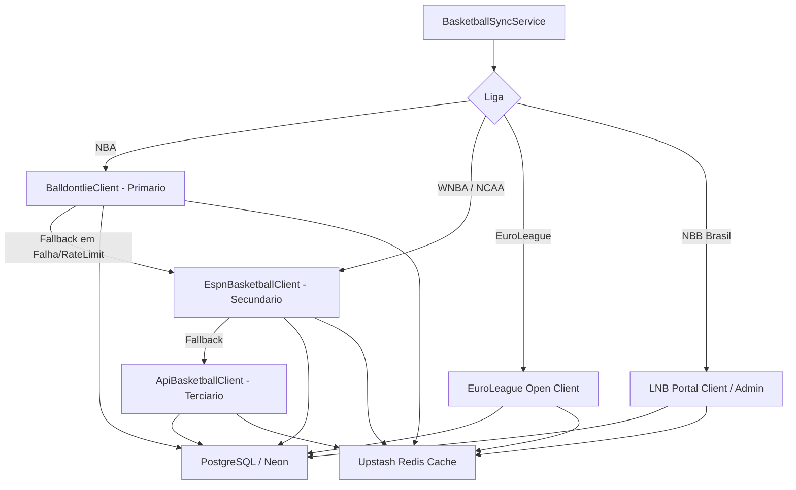

# ADR-0013: Basketball Integration & Free Data Strategy

## Status
Accepted

## Date
2026-07-30

## Context

O plano gratuito da API-Basketball (API-Sports) bloqueia requisições para a temporada atual (*current season*), exibindo paywalls para a NBA, NBB e EuroLeague. Como a plataforma opera sob premissa de custo zero (**[ADR-0002](file:///c:/Users/Vinicius/workspace/ligadospalpites-core/docs/adr/0002-cloud-deployment-free-tier.md)**), foi necessário estabelecer uma fonte alternativa livre para basquete.

## Decision

Decidimos integrar uma estratégia de dados de basquete 100% livre baseada em 3 pilares:

1. **NBA (balldontlie.io API v1 [Primário] + ESPN Public API [Fallback])**:
   - Utilização da **balldontlie.io API** (`/nba/v1/games`) como provedor primário via chave `BALLDONTLIE_API_KEY`, com fallback automático transparente para a **API Pública da ESPN** (`site.api.espn.com/apis/site/v2/sports/basketball/nba/scoreboard`) em caso de atingo de rate-limit ou indisponibilidade.
   - Acesso a jogos da temporada atual, datas, status e parciais de pontos.

2. **WNBA e NCAA (ESPN Public API)**:
   - Ingestão via API Pública da ESPN com dados ilimitados e logos 500x500 PNG.

3. **EuroLeague e EuroCup (EuroLeague JSON API)**:
   - Uso de endpoints abertos do portal oficial (`live.euroleague.net/api/Games`).
   - Fornece classificação e jogos de clubes europeus sem custo.

4. **NBB Brasil (LNB Portal JSON / Admin)**:
   - Consumo do endpoint JSON do site oficial da LNB ou gestão via Painel Admin/Seed SQL.

## Consequences

### Positive
* **Resiliência Multi-Provedor**: Se a `balldontlie.io` falhar ou atingir limite no plano gratuito, a `ESPN` assume automaticamente a ingestão de placares da NBA.
* **Liberdade de Temporada**: Jogos da temporada atual da NBA/WNBA liberados sem custos.
* **Padronização OpenAPI**: Estrutura tipada seguindo o contrato OpenAPI `nba.yml` da balldontlie.io.
