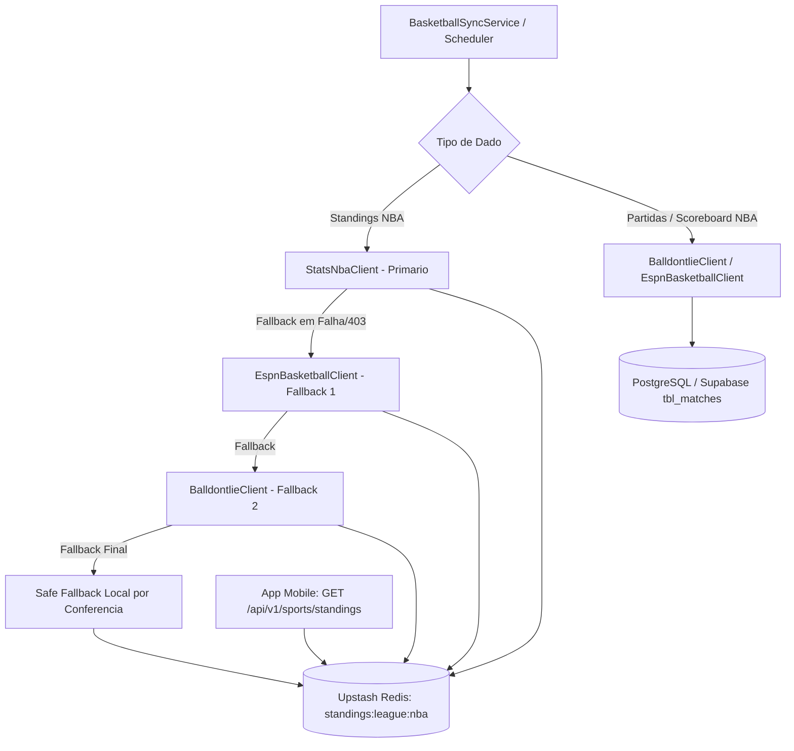

# ADR-0013: Basketball Integration & Free Data Strategy

## Status
Accepted

## Date
2026-07-30

## Context

O plano gratuito da API-Basketball (API-Sports) bloqueia requisições para a temporada atual (*current season*), exibindo paywalls para a NBA, NBB e EuroLeague. Como a plataforma opera sob premissa de custo zero (**[ADR-0002](file:///c:/Users/Vinicius/workspace/ligadospalpites-core/docs/adr/0002-cloud-deployment-free-tier.md)**), foi necessário estabelecer uma fonte alternativa livre para basquete.

## Decision

Decidimos integrar uma estratégia de dados de basquete 100% livre baseada em arquitetura multi-provedor resiliente e cache no Redis:

1. **NBA Standings / Classificação Oficial (stats.nba.com [Primário] + ESPN [Fallback 1] + balldontlie.io [Fallback 2])**:
   - **`stats.nba.com` (`leaguestandingsv3`)** como fonte oficial primária para classificação, garantindo 100% de paridade com as regras oficiais de desempate, divisão por conferência (*Eastern* / *Western*), *Games Behind* (GB), sequências e logos oficiais da CDN da NBA (`cdn.nba.com`).
   - Fallback automático para a **API Pública da ESPN** (`/nba/standings`) e **balldontlie.io** (`/nba/v1/standings`).
   - Cacheamento obrigatório em **Upstash Redis** (`standings:league:nba`, TTL 2h) para garantir respostas sub-10ms no aplicativo móvel.

2. **NBA Partidas e Calendário (balldontlie.io + ESPN Public API)**:
   - Ingestão com parciais por quarto (`periodScoresJson`), status em tempo real e logos HD.

3. **WNBA e NCAA (ESPN Public API)**:
   - Ingestão via API Pública da ESPN com dados ilimitados e logos 500x500 PNG.

4. **EuroLeague e EuroCup (EuroLeague JSON API)**:
   - Uso de endpoints abertos do portal oficial (`live.euroleague.net/api/Games`).
   - Fornece classificação e jogos de clubes europeus sem custo.

5. **NBB Brasil (LNB Portal JSON / Admin)**:
   - Consumo do endpoint JSON do site oficial da LNB ou gestão via Painel Admin/Seed SQL.

## Consequences

### Positive
* **Precisão Oficial Absoluta**: Classificação da NBA segue estritamente os critérios da liga via `stats.nba.com`, sem discrepâncias de desempate.
* **Resiliência Multi-Provedor**: Três camadas de provedores externos gratuitos com fallback automático e isolamento no Redis.
* **Alta Performance Mobile**: Requisições de tabela respondidas em < 10ms a partir do cache Redis, protegendo o usuário contra latências de APIs externas.
* **Liberdade de Temporada**: Dados da temporada atual sem necessidade de planos pagos.
