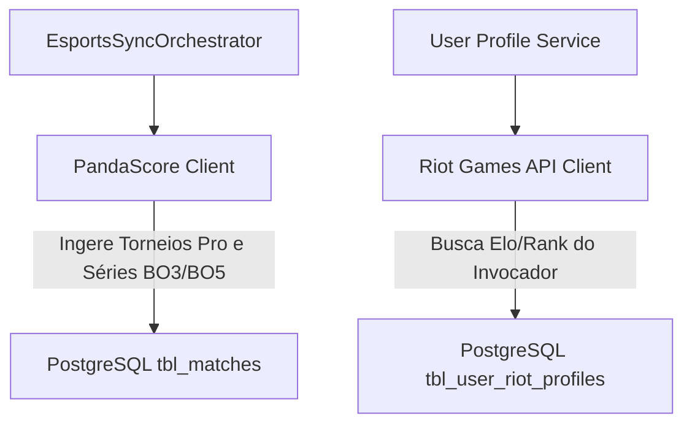

# ADR-0014: eSports Pro Data & Riot Profiling Strategy

## Status
Accepted

## Date
2026-07-30

## Context

O mercado de **eSports** (CS2, LoL, Valorant, Dota 2) exige dados de campeonatos profissionais (CBLOL, VCT Americas, CS2 Major, Worlds) e suporte a séries MD1, MD3 e MD5.

A Riot Games API oficial **não fornece tabelas ou calendários de campeonatos profissionais**, atendendo apenas dados in-game de invocadores. Por isso, definimos uma arquitetura híbrida de dois provedores.

## Decision

 Decidimos separar os papéis das APIs para eSports:

1. **PandaScore API (Primary Pro Data Provider)**:
   - Responsável por 100% da ingestão de campeonatos profissionais, calendários de partidas, formatos de série (BO1, BO3, BO5) e logos dos times pro (LOUD, FURIA, T1).

2. **Riot Games API (Secondary User Profiling Provider)**:
   - Responsável por vincular a conta do usuário no app (`Riot ID`), exibir seu Elo/Rank (Ouro, Diamante, Radiant) e permitir ligas exclusivas.

## Consequences

### Positive
* **Cobertura Pro Garantida**: PandaScore entrega os confrontos profissionais sem dependência de scraping.
* **Engajamento**: Riot API enriquece o perfil social do usuário com seu rank do jogo.
