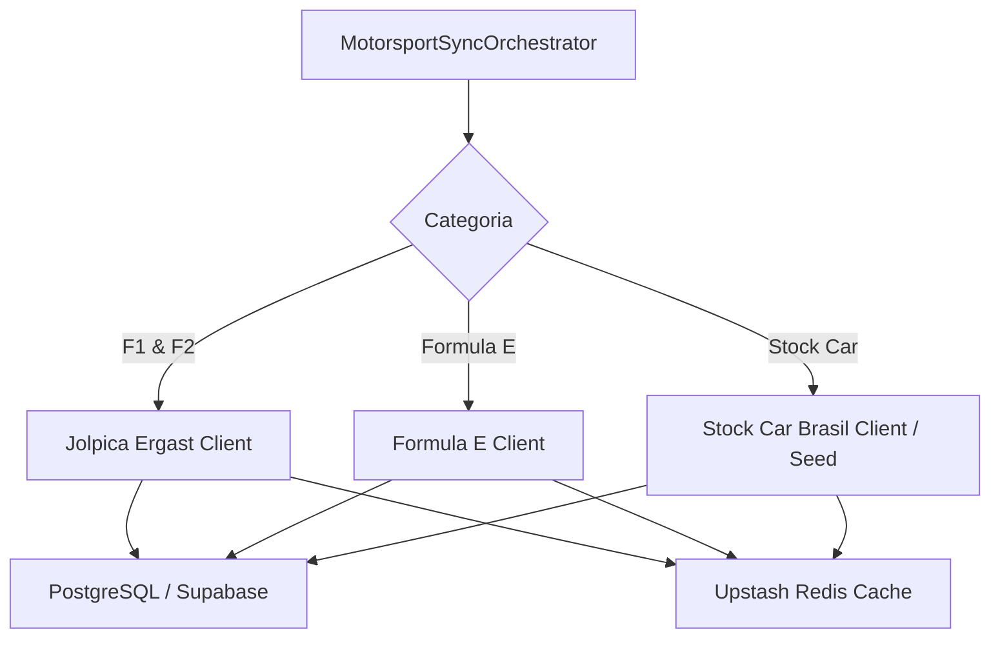

# ADR-0015: Motorsport (F1, F2, FE, Stock Car) Data Strategy

## Status
Accepted

## Date
2026-07-30

## Context

O automobilismo não possui confronto 1x1 direto entre dois times, funcionando no formato de etapas/GPs com Grid de largada, Treino Classificatório (*Qualifying*), Corrida Principal e Classificação de Pilotos/Construtores.

## Decision

Decidimos integrar os dados de corridas via APIs abertas e gratuitas especializadas:

1. **Fórmula 1 & Fórmula 2 (Jolpica Ergast API + OpenF1)**:
   - Ingestão via `api.jolpi.ca/ergast/f1/` e `/f2/`.
   - Entrega calendário de GPs, circuitos, horários de sessões, resultados de classificatórios e corridas.

2. **Fórmula E (FIA Formula E API)**:
   - Ingestão de etapas e Eprix de carros elétricos.

3. **Stock Car Pro Series (Stock Car Brasil API / Seed)**:
   - Ingestão de etapas do campeonato brasileiro (Interlagos, Goiânia, Cascavel, Tarumã).

## Consequences

### Positive
* **Formato Único Adaptado**: Permite palpites específicos de corrida (Pole Position, Vencedor e Pódio).
* **Custo Zero**: APIs abertas sem necessidade de chave paga.
