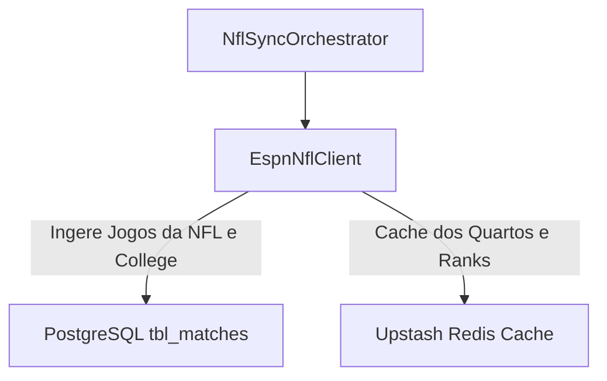

# ADR-0016: American Football (NFL & College) Data Strategy

## Status
Accepted

## Date
2026-07-30

## Context

A **NFL** (National Football League) e o **NCAA College Football** exigem acompanhamento de pontuação por quarto (Q1, Q2, Q3, Q4, OT) e possuem alta relevância durante a temporada regular e Playoffs.

## Decision

Decidimos utilizar a **API Pública da ESPN** como fonte primária gratuita para a NFL:

1. **ESPN Public API (`football/nfl`)**:
   - Accesso via `site.api.espn.com/apis/site/v2/sports/football/nfl/scoreboard`.
   - Oferece dados sem necessidade de API Key, sem bloqueios de temporada, com placares por quarto e logos 500x500 PNG das 32 franquias.

## Consequences

### Positive
* **100% Gratuito**: Sem custos com assinaturas da API-Sports para a NFL.
* **Mídias HD**: Escudos PNG das franquias atualizados via CDN da ESPN.
