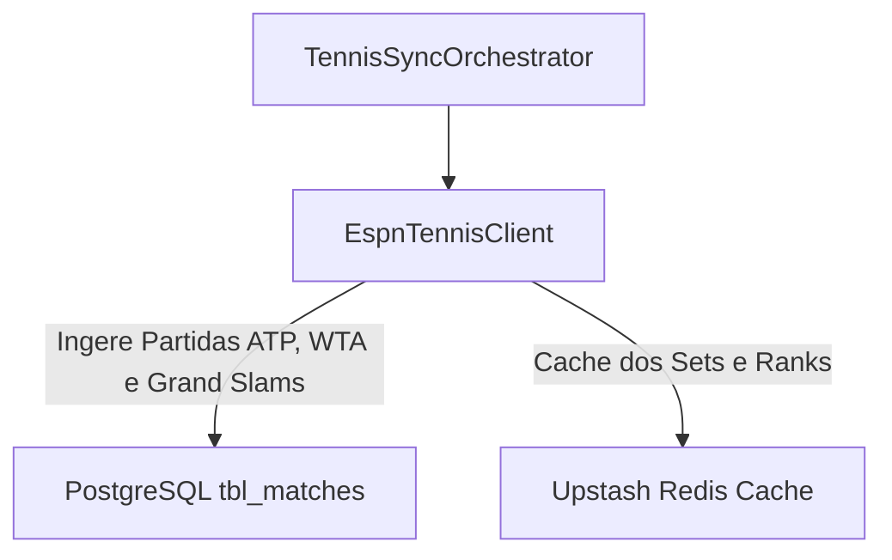

# ADR-0017: Tennis (ATP, WTA & Grand Slams) Data Strategy

## Status
Accepted

## Date
2026-07-30

## Context

O circuito mundial de tênis envolve torneios masculinos (**ATP Tour**), femininos (**WTA Tour**) e os 4 **Grand Slams** (Wimbledon, US Open, Roland Garros, Australian Open), exigindo acompanhamento parcial por sets.

## Decision

Decidimos integrar a modalidade de tênis via a **API Pública da ESPN**:

1. **ESPN Public API (`tennis/atp` e `tennis/wta`)**:
   - Acesso via `site.api.espn.com/apis/site/v2/sports/tennis/atp/scoreboard`.
   - Entrega confrontos, nomes dos tenistas, seeds, bandeiras dos países e parciais por set.

## Consequences

### Positive
* **Custo Zero**: Dados abertos de torneios mundiais sem custos de API.
* **Sets Parciais**: Acompanhamento de set a set no aplicativo.
