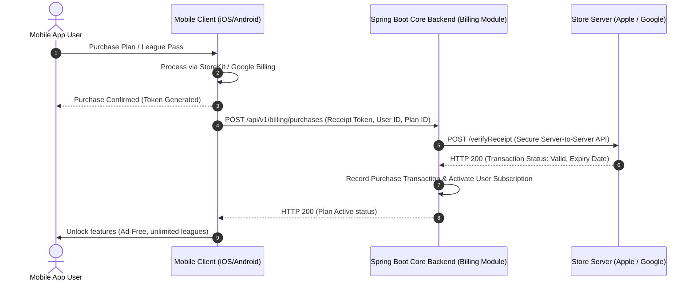

# System Architecture Design: Liga dos Palpites

This document details the architectural layout, modularization patterns, and integration layers of the **Liga dos Palpites** core backend, designed with **Kotlin** and **Spring Boot**.

---

## 1. Modular Monolith Design (Bounded Contexts)

To keep the application highly maintainable, prevent dependency spaghetti, and enable a frictionless path to microservices in the future, the backend uses a **Gradle Multi-Project Modular Monolith** structure.

### 1.1. Module Hierarchy

```text
ligadospalpites-core/
├── settings.gradle.kts                 # Defines subprojects
├── build.gradle.kts                    # Core build script & Spring Boot version configurations
│
├── apps/
│   └── main-app/                       # Spring Boot Application Bootstrapper (runner) & BFF Gateway
│       └── src/main/kotlin/com/ligadospalpites/app/Application.kt
│
└── packages/
    ├── shared/                         # Cross-cutting concerns
    │   └── core/                       # Shared domain interfaces, generic VOs, trace context
    │
    └── features/                       # Business capabilities (Bounded Contexts)
        ├── users/                      # Authentication, profile, basic details
        ├── billing/                    # Plan admin, App Store/Google receipt validation
        ├── predictions/                # Predictions (palpites), user points, leagues, rankings
        ├── sports-feed/                # Fixtures, live events, manual entry, third-party API ingestion
        └── notifications/              # Extensible notification engine (In-app, Push, Email, etc.)
```

### 1.2. Module Isolation Rules
1. **Database Autonomy**: No cross-module database joins or transactional couplings. Each feature module owns its tables (e.g., prefixing database tables like `tbl_billing_*`, `tbl_predictions_*`).
2. **API Boundary**: Módulos interact *only* through public APIs located in the root of the module (e.g., `BillingFacade`). Internal logic is hidden using Kotlin's `internal` visibility modifier.
3. **No Circular Dependencies**: Module dependencies must form a Directed Acyclic Graph (DAG). If Module A needs Module B, and Module B needs Module A, the design must be refactored using events or a common contract in `shared/core`.

---

## 2. Clean Architecture Pattern within Modules

Inside each feature module, we strictly enforce **Clean Architecture / Ports and Adapters**.

```text
               ┌────────────────────────────────────────────────────────┐
               │                INFRASTRUCTURE (ADAPTERS)               │
               │  (REST Controllers, JPA Entities, App Store Clients)   │
               │                                                        │
               │       ┌────────────────────────────────────────┐       │
               │       │               APPLICATION              │       │
               │       │     (Use Cases, Ports/Interfaces)      │       │
               │       │                                        │       │
               │       │       ┌────────────────────────┐       │       │
               │       │       │         DOMAIN         │       │       │
               │       │       │ (Entities, VOs, Rules) │       │       │
               │       │       └────────────────────────┘       │       │
               │       └────────────────────────────────────────┘       │
               └────────────────────────────────────────────────────────┘
```

### 2.1. Internal Directory Structure Example (`predictions` module)
```text
predictions/
├── src/main/kotlin/com/ligadospalpites/feature/predictions/
│   ├── api/                            # EXPOSED: Public interfaces & DTOs for other modules
│   │   ├── PredictionsFacade.kt
│   │   └── dtos/
│   │
│   ├── domain/                         # PURO KOTLIN: Core logic & Rules
│   │   ├── models/                     # Aggregate Roots (League, Palpite), Value Objects
│   │   ├── exceptions/                 # Domain-specific exceptions
│   │   └── ports/                      # Repositories & Gateway contracts
│   │
│   ├── application/                    # Orchestrates business cases
│   │   └── usecases/                   # e.g., SubmitPalpiteUseCase
│   │
│   └── infrastructure/                 # Framework & Integration implementations
│       ├── persistence/                # JPA entities, Spring Data Repositories, Adapters
│       ├── web/                        # REST Controllers & JSON DTOs
│       ├── messaging/                  # Event Listeners (Spring Events)
│       └── config/                     # Spring @Configuration class for the module
└── build.gradle.kts
```

---

## 3. In-App Purchase & Plan Management Architecture

Plan verification is a critical component handled by the `billing` module. Since payments occur through Apple App Store and Google Play Store, the system acts as a validator and administrator of purchased plans.

### 3.1. Store Purchase Integration Flow



### 3.2. Asynchronous Webhook Subscription Management
To handle auto-renewals, cancellations, and refunds, the system exposes public endpoints for App Store Server Notifications V2 and Google Play Developer Notifications:
- **Apple endpoint**: `/api/v1/webhooks/apple/notifications`
- **Google endpoint**: `/api/v1/webhooks/google/notifications`

When a notification is received, the `billing` module parses the JWS payload, determines the notification type (e.g., `SUBSCRIBED`, `DID_RENEW`, `EXPIRED`, `REFUND`), and updates the user's entitlements accordingly.

### 3.3. Cross-Module Access Control (Plan Enforcement)
When a user attempts to view a league or submit a palpite, the `predictions` module must verify if the user's plan permits it.

```kotlin
package com.ligadospalpites.feature.predictions.application.usecases

import com.ligadospalpites.feature.billing.api.BillingFacade // Dependency on Billing module interface

class VisualizarLigaUseCase(
    private val billingFacade: BillingFacade,
    private val leagueRepository: LeagueRepository
) {
    fun execute(userId: String, leagueId: String): League {
        val league = leagueRepository.buscarPorId(leagueId) 
            ?: throw LeagueNotFoundException(leagueId)
            
        // Query billing facade (sync query) to check if user has access to this league's sport
        val canAccess = billingFacade.verifySportAccess(userId, league.sportId)
        if (!canAccess) {
            throw AccessDeniedException("Seu plano não permite acessar este esporte. Faça um upgrade!")
        }
        return league
    }
}
```

---

## 4. Communication & Event-Driven Workflows

Modules communicate using two distinct patterns depending on whether the operation is query-oriented or event-driven.

### 4.1. Synchronous Queries (Method Calls)
- **Use Case**: Getting status, checking permissions, fetching simple profiles.
- **Rule**: Done via interface dependency injection. A module depends *only* on the `api/` package of another module.

### 4.2. Asynchronous Event-Driven (Spring Application Events)
- **Use Case**: Decoupled side effects (e.g., score processing, user registration side effects, pushing notifications).
- **Implementation**: We use Spring's `ApplicationEventPublisher` to publish events. Módulos listen using `@EventListener` (or `@TransactionalEventListener` to run after a transaction commits).

#### Scenario: Match Results Ingested and Scores Updated
When the `sports-feed` module registers a final score from the third-party Sports API:
1. `sports-feed` updates the match database table and publishes a `MatchFinishedEvent`.
2. `predictions` module receives the `MatchFinishedEvent`, calculates user predictions points, updates rankings, and publishes a `PredictionsProcessedEvent`.
3. `notifications` module listens to `PredictionsProcessedEvent` and dispatches a push notification to users showing their updated scores.

```text
┌─────────────┐                      ┌─────────────┐                     ┌───────────────┐
│ sports-feed │ ──MatchFinished───>  │ predictions │ ─PredictionsScored─>│ notifications │
└─────────────┘       Event          └─────────────┘        Event        └───────────────┘
```

---

## 5. Technology Stack & Framework Choices

- **Programming Language**: Kotlin 1.9+ (utilizing coroutines, inline value classes, functional expressions).
- **Core Framework**: Spring Boot 4.1.0 (MVC, JPA).
- **Primary Database**: PostgreSQL (relational storage hosted on Neon serverless PostgreSQL, with PgBouncer connection pooling).
- **Caching & Leaderboards**: Redis (active ranking tables stored in Redis ZSETs and session storage hosted on Upstash serverless Redis).
- **Third-Party Services**: 
  - Firebase Authentication (identity validation via JWT).
  - Firebase Cloud Messaging (push broker integration).
  - Firebase Storage (static media asset delivery).

---

## 6. Mobile App Integration & REST API Contract

To enable a fluid, dynamic frontend that automatically adapts to newly added sports/leagues and enforces subscription-based locking rules, the system exposes a set of metadata-driven REST endpoints. The mobile app should build its menus and dashboards dynamically from these responses.

### 6.1. Discovery & Entitlements: The Catalog API
This API lists all sports and leagues configured in the backend, indicating if the logged-in user can access them and what IAP product ID can be used to unlock them.

- **Endpoint**: `GET /api/v1/catalog/sports`
- **Authentication**: Required (JWT Bearer Token)
- **Response Format (`200 OK`)**:
```json
{
  "sports": [
    {
      "id": "3fa85f64-5717-4562-b3fc-2c963f66afa6",
      "name": "Futebol",
      "iconUrl": "https://cdn.ligadospalpites.com/icons/football.png",
      "unlocked": true,
      "purchaseProductId": null,
      "leagues": [
        {
          "id": "e7b0a8f9-4b2e-4b67-8890-a54b3d7c588e",
          "name": "Campeonato Brasileiro Série A",
          "country": "Brasil"
        },
        {
          "id": "8902a7b8-1b2c-3d4e-5f6a-7b8c9d0e1f2a",
          "name": "Premier League",
          "country": "Inglaterra"
        }
      ]
    },
    {
      "id": "407c64bb-1c4b-432b-8a8b-3e5fcd91e0a2",
      "name": "Basquete",
      "iconUrl": "https://cdn.ligadospalpites.com/icons/basketball.png",
      "unlocked": false,
      "purchaseProductId": "com.ligadospalpites.pass.basketball",
      "leagues": [
        {
          "id": "76fa9b8c-2d3e-4f5a-6b7c-8d9e0a1b2c3d",
          "name": "NBA",
          "country": "USA"
        }
      ]
    }
  ]
}
```

### 6.2. User Setup: Preferences & Initial State APIs
When a new user completes onboarding, they define their preferences. The backend processes this selection, records it, and automatically unlocks the chosen sport for free (if their unlocked sports record is empty).

#### Save User Preferences
- **Endpoint**: `POST /api/v1/users/preferences`
- **Request Body**:
```json
{
  "favoriteSportId": "3fa85f64-5717-4562-b3fc-2c963f66afa6",
  "favoriteLeagueIds": [
    "e7b0a8f9-4b2e-4b67-8890-a54b3d7c588e"
  ]
}
```
- **Response Format (`200 OK`)**:
```json
{
  "status": "SUCCESS",
  "message": "Preferences saved. Primary sport has been registered as unlocked."
}
```

#### Fetch App Initialization State
Upon startup, the mobile client executes this fast query to determine user profiles, plan states, active preferences, and all unlocked sports. This tells the app exactly which dashboard to initialize.
- **Endpoint**: `GET /api/v1/users/me/state`
- **Response Format (`200 OK`)**:
```json
{
  "userId": "9b1deb4d-3b7d-4bad-9bdd-2b0d7b3dcb6d",
  "name": "Jane Doe",
  "plan": "FREE",
  "unlockedSports": [
    "3fa85f64-5717-4562-b3fc-2c963f66afa6"
  ],
  "preferences": {
    "favoriteSportId": "3fa85f64-5717-4562-b3fc-2c963f66afa6",
    "favoriteLeagueIds": [
      "e7b0a8f9-4b2e-4b67-8890-a54b3d7c588e"
    ]
  }
}
```

### 6.3. The Dynamic Dashboard Feed API
Instead of hardcoding schemas for each sport, the app queries a dynamic feed endpoint that returns fixtures, standings, and active predictions using a polymorphic score model. The app uses the `score.format` descriptor to determine how to render scores (e.g. goals vs basketball points vs quarters).

- **Endpoint**: `GET /api/v1/feed/sports/{sportId}`
- **Query Parameter**: `leagueId` (UUID, optional. If omitted, defaults to the user's primary league preference or the top league in that sport).
- **Response Format (`200 OK`)**:
```json
{
  "sportId": "3fa85f64-5717-4562-b3fc-2c963f66afa6",
  "sportName": "Futebol",
  "activeLeague": {
    "id": "e7b0a8f9-4b2e-4b67-8890-a54b3d7c588e",
    "name": "Campeonato Brasileiro Série A"
  },
  "fixtures": [
    {
      "fixtureId": "d0d6a9e1-2b3c-4d5e-6f7a-8b9c0d1e2f3a",
      "status": "LIVE",
      "kickoffTime": "2026-07-09T22:30:00Z",
      "homeTeam": { "name": "Flamengo", "logoUrl": "https://cdn.example.com/teams/flamengo.png" },
      "awayTeam": { "name": "Palmeiras", "logoUrl": "https://cdn.example.com/teams/palmeiras.png" },
      "score": {
        "format": "STANDARD_GOALS",
        "home": 2,
        "away": 1,
        "extraInfo": null
      },
      "userPrediction": {
        "predictionId": "e1e2e3e4-f5f6-7788-9900-aabbccddeeff",
        "predictedHome": 2,
        "predictedAway": 1,
        "pointsAwarded": 10,
        "isProcessed": true
      }
    }
  ]
}
```

*Note: For Basketball, the `fixtures[].score` would return:*
```json
"score": {
  "format": "STANDARD_POINTS",
  "home": 102,
  "away": 98,
  "extraInfo": "Quarter 4 - 0:15 remaining"
}
```

### 6.4. Access Control & Gatekeeping
If the mobile app attempts to call the feed or submit a prediction for a sport that is not unlocked in the user's entitlements, the API gateway or controller will intercept it and return a standardized exception payload.

- **Status Code**: `403 Forbidden`
- **Response Payload**:
```json
{
  "errorCode": "SPORT_ACCESS_LOCKED",
  "message": "Seu plano atual não possui acesso a este esporte. Adquira o passe de esporte para continuar.",
  "details": {
    "sportId": "407c64bb-1c4b-432b-8a8b-3e5fcd91e0a2",
    "sportName": "Basquete",
    "purchaseProductId": "com.ligadospalpites.pass.basketball"
  }
}
```
*Action Flow:* The mobile application captures this `403` status and `SPORT_ACCESS_LOCKED` code, interrupts navigation, and triggers the native StoreKit/Google Play billing modal using the `purchaseProductId`.

---

## 7. External Ingestion & Job Scheduling (Scale-to-Zero)

To support **Scale-to-Zero** in a serverless environment (Google Cloud Run), the backend avoids internal thread-based scheduling (`@Scheduled` JVM timers). Instead, tasks are pulled from the outside:
1. **HTTP Trigger Endpoints**: The application exposes secure, internal HTTP routes (e.g. `POST /api/v1/internal/scheduler/process?sportId=...&leagueId=...`).
2. **GCP Cloud Scheduler**: Periodic Cloud Scheduler crons invoke these endpoints. 
3. **Concurrency Control**: The load balancer routes the HTTP request to exactly one active container instance (pod), avoiding double-processing or distributed lock issues.

---

## 8. Hybrid Data Strategy: Profile Partitioning

To reduce heavy PostgreSQL write throughput and utilize Firebase's native synchronization:
- **Firebase Firestore**: Stores user profiles (`displayName`, `avatarUrl`) and application preferences (favorite sports, league subscriptions, notifications settings). The mobile client reads/writes directly to Firestore.
- **PostgreSQL (Neon)**: Acts as the primary transactional repository. Stores user local IDs mapping (`firebase_uid` -> `userId`), billing entitlements, predictions, and group memberships.
- **Redis (Upstash)**: Caches phase-based group rankings using Sorted Sets (ZSET) partitioned by:
  - `overall`
  - `group-stage`
  - `knockout`
- **Data Aggregation**: When querying leaderboards or profile endpoints, the backend BFF retrieves Postgres data and combines it in parallel with metadata fetched from Firebase Firestore.
