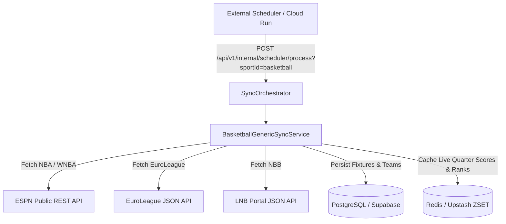

# Product Requirement Document (PRD): Basketball Integration & Free Data Providers

## 1. Visão Geral e Objetivo Executivo

Com a consolidação da plataforma **Liga dos Palpites** como um Hub Multi-Esportivo (conforme **[ADR-0006](file:///c:/Users/Vinicius/workspace/ligadospalpites-core/docs/adr/0006-sports-data-sync-engine.md)**), o módulo de **Basquete** expande o engajamento do aplicativo cobrindo tanto as ligas internacionais de alta visibilidade (**NBA**, **EuroLeague**, **WNBA**) quanto a liga nacional brasileira (**NBB - Novo Basquete Brasil**).

Este documento especifica os requisitos funcionais, não-funcionais, modelo de pontuação de palpites e a **estratégia de dados 100% gratuita** para contornar os bloqueios de temporada atual impostos por APIs comerciais como a API-Basketball.

---

## 2. Estratégia de Provedores Gratuitos por Liga de Basquete

Diante do bloqueio de dados da temporada atual no plano gratuito da API-Basketball, a arquitetura adotará uma estratégia de ingestão híbrida baseada em APIs abertas e sem custos:

### 📊 Matriz de Provedores de Dados

| Liga / Competição | Provedor Principal | Endpoint / Fonte | Custo / Restrições | Ativos Visuais (Logos) |
| :--- | :--- | :--- | :--- | :--- |
| **NBA** | **balldontlie.io API** + **ESPN Public API** | `GET site.api.espn.com/apis/site/v2/sports/basketball/nba/scoreboard` | 🟢 100% Gratuito (Sem API Key, Sem bloqueio de temporada) | CDN da ESPN (500x500 PNG) + TheSportsDB |
| **EuroLeague & EuroCup** | **EuroLeague Internal JSON API** | `GET live.euroleague.net/api/Games` + `v3.euroleague.net/.../standings` | 🟢 100% Gratuito (Endpoints abertos do portal oficial) | EuroLeague Assets |
| **WNBA & NCAA** | **ESPN Public API** | `GET site.api.espn.com/apis/site/v2/sports/basketball/wnba/scoreboard` | 🟢 100% Gratuito | CDN da ESPN |
| **NBB (Brasil)** | **LNB Portal JSON API** / Admin Seed | `GET lnb.com.br/wp-json/lnb/v1/partidas` | 🟢 100% Gratuito / Fallback via Seed SQL | Escudos Oficiais NBB |

---

## 3. Requisitos Funcionais (FRs)

### 3.1. Ingestão de Partidas e Calendário de Basquete
* **FR-BSK-1.1**: O sistema deve sincronizar as partidas das seguintes ligas ativas:
  * **NBA** (National Basketball Association - EUA)
  * **NBB** (Novo Basquete Brasil - Brasil)
  * **EuroLeague** (Turkish Airlines EuroLeague - Europa)
  * **WNBA** (Women's National Basketball Association - EUA)
* **FR-BSK-1.2**: O status da partida de basquete deve refletir a fase do jogo:
  * `SCHEDULED`: Partida agendada.
  * `IN_PROGRESS`: Partida em andamento com detalhamento de período (`Q1`, `Q2`, `Q3`, `Q4`, `OVERTIME`).
  * `FINISHED`: Partida encerrada com placar final.
* **FR-BSK-1.3**: Armazenamento de Pontuação por Quarto: Para cada partida de basquete, a pontuação acumulada e por quarto de ambas as equipes deve ser persistida para exibição no aplicativo.

### 3.2. Regras de Pontuação de Palpites para Basquete
* **FR-BSK-2.1**: Como no basquete as pontuações são altas e não há empates, a pontuação de palpites segue uma dinâmica baseada em **Margem de Vitória**:
  * **Vencedor Correto + Margem Exata de Pontos** (ex: Palpite Lakers por 5 pts de diferença, jogo termina Lakers +5): Pontuação máxima (ex: 25 pts).
  * **Vencedor Correto + Margem Próxima** (diferença de até 3 pontos na margem): Pontuação elevada (ex: 18 pts).
  * **Vencedor Correto + Margem Distante**: Pontuação base por acertar a equipe vencedora (ex: 10 pts).
  * **Palpite Bônus por Pontuação Total da Partida (Over/Under)**: Acertar a faixa de pontos totais somados no jogo (ex: Mais de 210 pontos).

### 3.3. Preferências do Usuário & Onboarding
* **FR-BSK-3.1**: Usuários no cadastro ou na aba de perfil podem definir o Basquete como seu esporte principal e escolher seu time favorito (ex: Los Angeles Lakers, Flamengo Basquete, Boston Celtics, Franca).
* **FR-BSK-3.2**: O BFF Dashboard deve renderizar os cards de basquete adaptados, exibindo a pontuação detalhada por quarto e a margem de pontos.

---

## 4. Requisitos Não-Funcionais (NFRs)

* **NFR-BSK-1.1 (Rate Limit & Caching)**: Todas as chamadas para a ESPN API, EuroLeague API e balldontlie devem passar por um mecanismo de cache local com **Upstash Redis** (TTL de 60 segundos durante partidas ao vivo e 24h para calendários de jogos futuros).
* **NFR-BSK-1.2 (Resiliência & Fallback)**: Implementar **CircuitBreaker** (Resilience4j) na comunicação externa HTTP. Se a fonte do NBB estiver temporariamente indisponível, o sistema utiliza as partidas salvas no PostgreSQL sem travar o aplicativo.
* **NFR-BSK-1.3 (Desempenho no Mobile)**: A resposta do BFF Dashboard para a aba de Basquete deve ser entregue em tempo inferior a **150ms**.

---

## 5. Arquitetura do Motor de Sincronização

Seguindo a especificação da **[ADR-0006](file:///c:/Users/Vinicius/workspace/ligadospalpites-core/docs/adr/0006-sports-data-sync-engine.md)**, o basquete será gerenciado pelo serviço especializado `BasketballGenericSyncService`:

### Extensões no Schema do Banco de Dados (PostgreSQL):

1. **`tbl_matches` (Campos de Basquete)**:
   - `period_scores_json` (JSONB): Armazena as parciais por quarto (ex: `{"home": [28, 30, 22, 25], "away": [24, 25, 29, 21]}`).
   - `total_points` (INT): Soma total de pontos marcados pelas duas equipes.

2. **`tbl_leagues` (Seed para Basquete)**:
   - `5c1e3a11-b9db-44ab-ba02-411a0c0bcf14`: NBA
   - `2dbd1112-9cde-4411-b0db-b06d0421da6a`: NBB
   - `3c1e3a11-b9db-44ab-ba02-411a0c0bcf14`: EuroLeague

---

## 6. Plano de Entrega e Fases

1. **Fase 1 (NBA & WNBA)**: Integração do `EspnBasketballClient` para sincronização completa da temporada atual da NBA e WNBA com logos HD.
2. **Fase 2 (EuroLeague)**: Implementação do `EuroleagueClient` consumindo os endpoints abertos da EuroLeague.
3. **Fase 3 (NBB Brasil)**: Conexão com o endpoint JSON da LNB e validação das regras de margem de pontos para palpites de basquete.
