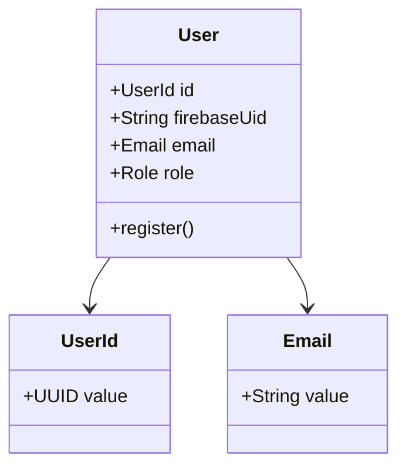
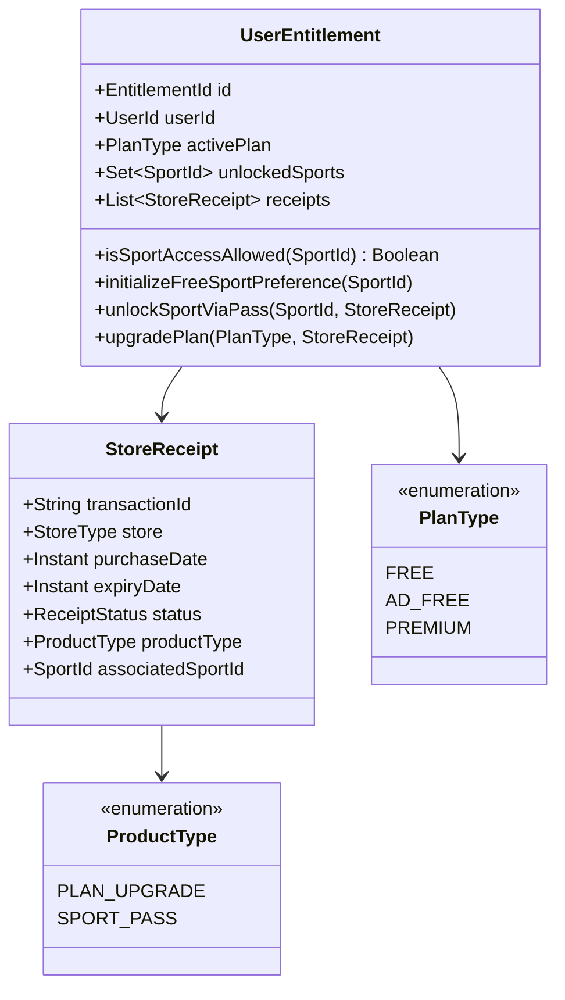
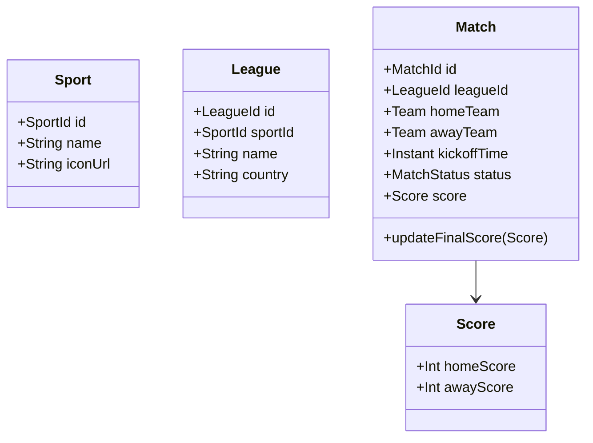
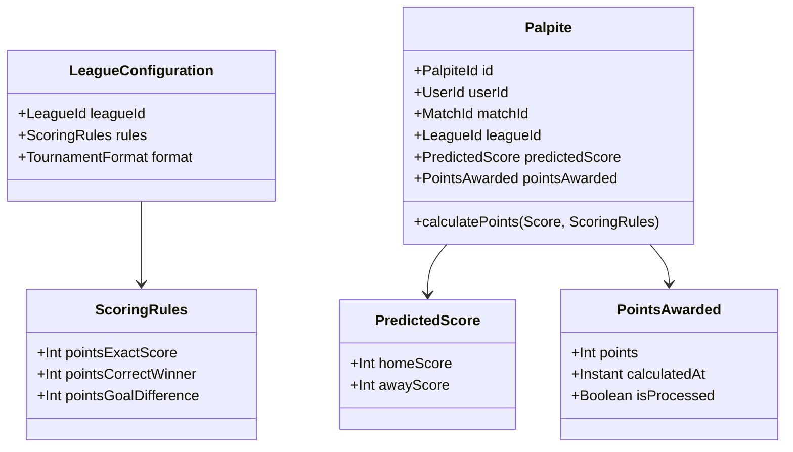
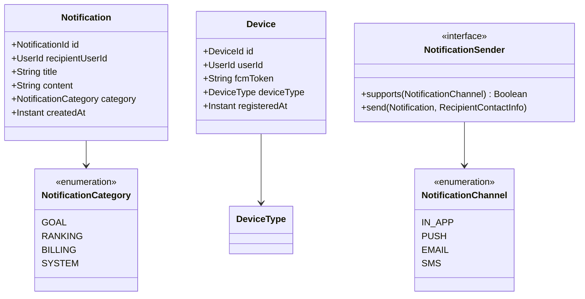

# Domain Model Specification: Liga dos Palpites

This document details the Domain-Driven Design (DDD) model for the **Liga dos Palpites** core platform. It maps out aggregates, aggregate roots, entities, and value objects (VOs) using Kotlin.

---

## 1. Domain Model Architecture Guidelines
- **Reference by ID only**: No domain model holds direct object references (like JPA annotations `@ManyToOne`) to entities outside its own aggregate boundary. They reference other aggregates strictly by ID (e.g., `LeagueId`, `UserId`).
- **Primitive Obsession Avoidance**: Use inline value classes (e.g., `@JvmInline value class LeagueId(val value: UUID)`) to prevent passing incorrect IDs to methods.
- **Imutabilidade**: All Value Objects must be immutable, using `val` and validating state in their `init` blocks.

---

## 2. Bounded Context: Users (`users`)

The `users` module maintains registered users and profiles. Under the **Hybrid Profile Storage Partitioning** strategy:
- **Firebase Firestore**: Stores dynamic user metadata (such as `displayName` and `avatarUrl`) and mobile preference configurations (such as `favoriteSportId`, `favoriteLeagueIds`, and category notification settings).
- **PostgreSQL**: Stores local index maps (`firebase_uid` -> `userId`), billing entitlement linkages, and audit trail attributes.



---

## 3. Bounded Context: Billing & Plans (`billing`)

Enforces access rules. All plan payments are resolved via App Store / Google Play and validated on the backend.



### Kotlin Implementation Example: `UserEntitlement` Aggregate Root
```kotlin
package com.ligadospalpites.feature.billing.domain.models

import java.time.Instant
import java.util.UUID

@JvmInline value class UserId(val value: UUID)
@JvmInline value class SportId(val value: UUID)
@JvmInline value class EntitlementId(val value: UUID)

enum class PlanType { FREE, AD_FREE, PREMIUM }
enum class StoreType { APPLE_APP_STORE, GOOGLE_PLAY }
enum class ReceiptStatus { ACTIVE, EXPIRED, REFUNDED }
enum class ProductType { PLAN_UPGRADE, SPORT_PASS }

data class StoreReceipt(
    val transactionId: String,
    val store: StoreType,
    val purchaseDate: Instant,
    val expiryDate: Instant,
    val status: ReceiptStatus,
    val productType: ProductType,
    val associatedSportId: SportId? = null
)

class UserEntitlement(
    val id: EntitlementId,
    val userId: UserId,
    var activePlan: PlanType,
    val unlockedSports: MutableSet<SportId> = mutableSetOf()
) {
    private val _receipts = mutableListOf<StoreReceipt>()
    val receipts: List<StoreReceipt> get() = _receipts.toList()

    fun isSportAccessAllowed(sportId: SportId): Boolean {
        if (activePlan == PlanType.PREMIUM) return true
        return unlockedSports.contains(sportId)
    }

    fun initializeFreeSportPreference(sportId: SportId) {
        // A Free or Ad-Free user gets their first sport preference unlocked for free.
        // Once defined, they cannot change their free sport slot unless under specific admin rules.
        if (unlockedSports.isEmpty()) {
            unlockedSports.add(sportId)
        }
    }

    fun unlockSportViaPass(sportId: SportId, receipt: StoreReceipt) {
        require(receipt.productType == ProductType.SPORT_PASS) { "Invalid product type for Sport Pass" }
        require(receipt.status == ReceiptStatus.ACTIVE) { "Receipt must be active to unlock sport" }
        
        unlockedSports.add(sportId)
        _receipts.add(receipt)
    }

    fun upgradePlan(newPlan: PlanType, receipt: StoreReceipt) {
        require(receipt.productType == ProductType.PLAN_UPGRADE) { "Invalid product type for Plan Upgrade" }
        require(receipt.status == ReceiptStatus.ACTIVE) { "Receipt must be active to upgrade plan" }
        
        this.activePlan = newPlan
        _receipts.add(receipt)
    }
}
```

---

## 4. Bounded Context: Sports & Fixtures (`sports-feed`)

Handles sports metadata, matches (fixtures), and team listings.



---

## 5. Bounded Context: Predictions & Competitions (`predictions`)

The core execution space where users make predictions and leagues apply customized scoring rules.



### Kotlin Implementation Example: `Palpite` Aggregate Root and `ScoringRules` Value Object
```kotlin
package com.ligadospalpites.feature.predictions.domain.models

import java.time.Instant
import java.util.UUID

@JvmInline value class PalpiteId(val value: UUID)
@JvmInline value class UserId(val value: UUID)
@JvmInline value class MatchId(val value: UUID)
@JvmInline value class LeagueId(val value: UUID)

data class PredictedScore(val homeScore: Int, val awayScore: Int) {
    init {
        require(homeScore >= 0) { "Scores cannot be negative" }
        require(awayScore >= 0) { "Scores cannot be negative" }
    }
}

data class PointsAwarded(
    val points: Int,
    val calculatedAt: Instant,
    val isProcessed: Boolean
)

data class ScoringRules(
    val pointsExactScore: Int = 10,
    val pointsCorrectWinner: Int = 5,
    val pointsGoalDifference: Int = 3
) {
    init {
        require(pointsExactScore > pointsCorrectWinner) { "Exact match points must exceed simple winner points" }
    }

    fun evaluate(predicted: PredictedScore, actualHome: Int, actualAway: Int): Int {
        // Case 1: Exact Score Matching
        if (predicted.homeScore == actualHome && predicted.awayScore == actualAway) {
            return pointsExactScore
        }
        
        val actualWinner = when {
            actualHome > actualAway -> 1
            actualHome < actualAway -> -1
            else -> 0
        }
        
        val predictedWinner = when {
            predicted.homeScore > predicted.awayScore -> 1
            predicted.homeScore < predicted.awayScore -> -1
            else -> 0
        }

        // Correct winner predicted?
        if (predictedWinner == actualWinner) {
            val actualDiff = actualHome - actualAway
            val predictedDiff = predicted.homeScore - predicted.awayScore
            
            // Case 2: Correct winner AND correct goal difference
            if (actualDiff == predictedDiff) {
                return pointsCorrectWinner + pointsGoalDifference
            }
            
            // Case 3: Correct winner only
            return pointsCorrectWinner
        }
        
        // No match / incorrect prediction
        return 0
    }
}

class Palpite(
    val id: PalpiteId,
    val userId: UserId,
    val matchId: MatchId,
    val leagueId: LeagueId,
    val predictedScore: PredictedScore,
    var pointsAwarded: PointsAwarded = PointsAwarded(0, Instant.now(), false)
) {
    fun scorePalpite(actualHomeScore: Int, actualAwayScore: Int, rules: ScoringRules) {
        val calculatedPoints = rules.evaluate(predictedScore, actualHomeScore, actualAwayScore)
        this.pointsAwarded = PointsAwarded(
            points = calculatedPoints,
            calculatedAt = Instant.now(),
            isProcessed = true
        )
    }
}

// Special Tournament Prediction Aggregate Root
@JvmInline value class SpecialPredictionId(val value: UUID)

enum class SpecialPredictionType { CHAMPION, TOP_SCORER }

class SpecialPrediction(
    val id: SpecialPredictionId,
    val userId: UserId,
    val leagueId: LeagueId,
    val type: SpecialPredictionType,
    val predictionValue: String,
    var pointsAwarded: Int = 0,
    var isProcessed: Boolean = false
) {
    fun scoreSpecialPrediction(correctValue: String, points: Int) {
        if (predictionValue.trim().lowercase() == correctValue.trim().lowercase()) {
            this.pointsAwarded = points
        }
        this.isProcessed = true
    }
}
```

---

## 6. JPA Persistence Mapping Isolation
As specified by our Clean Architecture layout, the Domain is composed of clean Kotlin classes. The database implementation details reside entirely in the `infrastructure/persistence` layer.

### Conversion Mapping Example
```kotlin
package com.ligadospalpites.feature.predictions.infrastructure.persistence

import com.ligadospalpites.feature.predictions.domain.models.*
import jakarta.persistence.*
import java.time.Instant
import java.util.UUID

@Entity
@Table(name = "tbl_predictions")
class PalpiteJpaEntity(
    @Id val id: UUID,
    @Column(nullable = false) val userId: UUID,
    @Column(nullable = false) val matchId: UUID,
    @Column(nullable = false) val leagueId: UUID,
    @Column(nullable = false) val predictedHomeScore: Int,
    @Column(nullable = false) val predictedAwayScore: Int,
    @Column(nullable = false) val pointsAwarded: Int,
    @Column(nullable = false) val calculatedAt: Instant,
    @Column(nullable = false) val isProcessed: Boolean
) {
    fun toDomain(): Palpite = Palpite(
        id = PalpiteId(id),
        userId = UserId(userId),
        matchId = MatchId(matchId),
        leagueId = LeagueId(leagueId),
        predictedScore = PredictedScore(predictedHomeScore, predictedAwayScore),
        pointsAwarded = PointsAwarded(pointsAwarded, calculatedAt, isProcessed)
    )

    companion object {
        fun fromDomain(domain: Palpite): PalpiteJpaEntity = PalpiteJpaEntity(
            id = domain.id.value,
            userId = domain.userId.value,
            matchId = domain.matchId.value,
            leagueId = domain.leagueId.value,
            predictedHomeScore = domain.predictedScore.homeScore,
            predictedAwayScore = domain.predictedScore.awayScore,
            pointsAwarded = domain.pointsAwarded.points,
            calculatedAt = domain.pointsAwarded.calculatedAt,
            isProcessed = domain.pointsAwarded.isProcessed
        )
    }
}
```

---

## 7. Bounded Context: Notifications (`notifications`)

Responsible for routing and delivering messages across multiple channels.



### Kotlin Implementation Example

```kotlin
package com.ligadospalpites.feature.notifications.domain.models

import java.time.Instant
import java.util.UUID

@JvmInline value class NotificationId(val value: UUID)
@JvmInline value class DeviceId(val value: UUID)
@JvmInline value class UserId(val value: UUID)

enum class NotificationChannel { IN_APP, PUSH, EMAIL, SMS }
enum class NotificationCategory { GOAL, RANKING, BILLING, SYSTEM }
enum class DeviceType { ANDROID, IOS }

data class RecipientContactInfo(
    val email: String?,
    val activeFcmTokens: List<String>
)

class Notification(
    val id: NotificationId,
    val recipientUserId: UserId,
    val title: String,
    val content: String,
    val category: NotificationCategory,
    val createdAt: Instant = Instant.now()
)

class Device(
    val id: DeviceId,
    val userId: UserId,
    val fcmToken: String,
    val deviceType: DeviceType,
    val registeredAt: Instant = Instant.now()
)

interface NotificationSender {
    fun supports(channel: NotificationChannel): Boolean
    fun send(notification: Notification, recipient: RecipientContactInfo)
}
```
