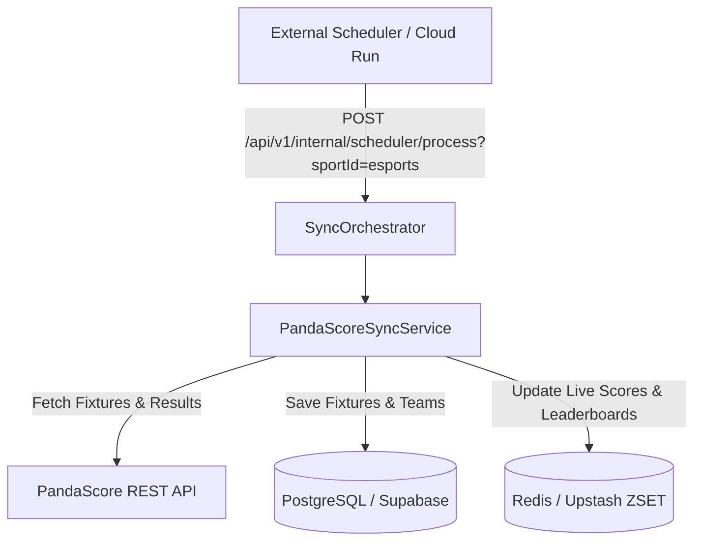

# Product Requirement Document (PRD): eSports Integration & Data Providers

## 1. Visão Geral e Objetivo Executivo

Com a expansão da plataforma **Liga dos Palpites** para um Hub Multi-Esportivo (conforme estabelecido na **[ADR-0006](file:///c:/Users/Vinicius/workspace/ligadospalpites-core/docs/adr/0006-sports-data-sync-engine.md)**), o módulo de **eSports** passa a ser um pilar estratégico para engajar o público jovem e os entusiastas de esportes eletrônicos.

Este documento estabelece a arquitetura de dados, a avaliação técnica de provedores de API, a estratégia de integração híbrida (**PandaScore** + **Riot Games API**) e os requisitos funcionais e não-funcionais para o suporte a modalidades como **League of Legends (LoL)**, **Counter-Strike 2 (CS2)**, **Valorant** e **Dota 2**.

---

## 2. Avaliação de Provedores: Riot Games API vs. PandaScore API

A premissa inicial analisou se a **Riot Games API** poderia atuar como a única provedora de dados para eSports. Abaixo está a matriz comparativa técnica que definiu o papel de cada provedor no ecossistema:

### 📊 Matriz Comparativa

| Funcionalidade / Dado Necessário | Riot Games API | PandaScore API | Decisão de Provedor Principal |
| :--- | :--- | :--- | :--- |
| **Calendário de Jogos Profissionais (Fixtures)** *(CBLOL, VCT, Worlds, Major)* | ❌ Não oferece (Apenas partidas públicas/ranqueadas de jogadores) | 🟢 **Excelente** (Grade completa de jogos com datas, horários e ligas pro) | **PandaScore** (Exclusivo) |
| **Times e Organizações Profissionais** *(LOUD, FURIA, Pain, T1, G2)* | ❌ Não oferece | 🟢 **Excelente** (Logos HD, países, rosters de pro-players) | **PandaScore** (Exclusivo) |
| **Formatos de Séries de Torneio** *(MD1, MD3, MD5 / Best of)* | ❌ Não oferece | 🟢 **Excelente** (Suporta pontuação e resultado por mapa/série) | **PandaScore** (Exclusivo) |
| **Cobertura Multijogos** *(CS2, Dota 2, Rocket League)* | ❌ Apenas títulos Riot (LoL, Valorant, TFT) | 🟢 **Excelente** (Suporta múltiplos títulos de eSports) | **PandaScore** (Exclusivo) |
| **Estatísticas In-Game do Usuário / Invocador** *(Rank do usuário, KDA casual)* | 🟢 **Excelente** (Histórico individual, Elo, PUUID) | ❌ Não oferece | **Riot Games API** (Exclusivo) |
| **Placares em Tempo Real (Live Scores)** | 🟡 Apenas jogos ativos do invocador via Spectator | 🟢 Placares ao vivo das séries profissionais | **PandaScore** (Principal) |

### 🎯 Conclusão de Arquitetura Híbrida:
1. **PandaScore como Provedor Principal (Primary Pro Sports Data)**: 
   Será responsável por **100% da ingestão de torneios profissionais de eSports** (tabelas, calendário de partidas, times profissionais, escudos/logos e resultados das séries MD3/MD5).
2. **Riot Games API como Provedor Secundário/Complementar (User Profiling & Gamification)**:
   Será utilizada para **funcionalidades de engajamento do usuário**, como permitir que o usuário vincule sua conta do LoL/Valorant no perfil do app, exiba seu Elo/Rank e participe de ligas privadas exclusivas de invocadores.

---

## 3. Requisitos Funcionais (FRs)

### 3.1. Ingestão de Torneios e Partidas de eSports
* **FR-ESP-1.1**: O sistema deve ingerir dados de partidas das principais modalidades de eSports:
  * **League of Legends**: CBLOL, LCK, LEC, LCS, Worlds, MSI.
  * **Valorant**: VCT Americas, VCT EMEA, VCT Pacific, VCT Champions.
  * **Counter-Strike 2 (CS2)**: PGL Major, ESL Pro League, IEM Katowice/Cologne.
  * **Dota 2**: The International, ESL One.
* **FR-ESP-1.2**: O motor de sincronização deve suportar os diferentes formatos de série de eSports:
  * **BO1 (Best of 1)**: Partida única.
  * **BO3 (Best of 3 / MD3)**: Primeiro a vencer 2 mapas.
  * **BO5 (Best of 5 / MD5)**: Primeiro a vencer 3 mapas.
* **FR-ESP-1.3**: Os escudos e logos dos times profissionais (ex: LOUD, FURIA, T1) devem ser ingeridos e armazenados em cache/CDN para renderização rápida nos aplicativos mobile.

### 3.2. Regras de Pontuação de Palpites para eSports
* **FR-ESP-2.1**: A plataforma deve permitir regras de palpites personalizadas por formato de série:
  * **Palpite de Placar da Série (MD3/MD5)**: O usuário indica o placar exato da série (ex: LOUD 2 x 1 FURIA em uma MD3).
    * *Placar Exato da Série*: Pontuação máxima (ex: 25 pts).
    * *Vencedor Correto com Saldo Diferente*: Pontuação intermediária (ex: 15 pts para palpitar 2x0 e terminar 2x1).
    * *Apenas Vencedor*: Pontuação base (ex: 10 pts).
  * **Palpite de Vencedor do 1º Mapa (First Map Winner)**: Pontuação bônus opcional para quem acerta o vencedor do Map 1.

### 3.3. Integração com Riot Games API (Perfil do Usuário)
* **FR-ESP-3.1**: Permitir que o usuário conecte seu `Riot ID` (ex: `Nick#TAG`) via backend.
* **FR-ESP-3.2**: Exibir no perfil do usuário no app a sua insígnia de Elo/Rank atual (ex: *Ouro IV*, *Diamante II*, *Radiant*) obtida diretamente da Riot API.
* **FR-ESP-3.3**: Ligas Privadas por Elo: Permitir a criação de ligas de palpites restritas a invocadores de determinados tiers de rank.

---

## 4. Requisitos Não-Funcionais (NFRs)

* **NFR-ESP-1.1 (Rate Limit & Caching)**: A ingestão via PandaScore Free/Paid deve respeitar estritamente os limites de requisição por minuto. Todas as partidas e classificações devem ser armazenadas em **PostgreSQL** e cacheadas em **Upstash Redis**.
* **NFR-ESP-1.2 (Resiliência)**: Implementar o padrão **Circuit Breaker** (Resilience4j) na comunicação com as APIs externas (PandaScore e Riot API) para evitar indisponibilidade em cascata no aplicativo.
* **NFR-ESP-1.3 (Latência do BFF)**: O endpoint BFF Dashboard para eSports deve responder em menos de **150ms** servindo dados consolidados a partir do cache Redis.

---

## 5. Arquitetura de Ingestão e Mapeamento de Domínio

Seguindo o padrão de estratégia definido na **[ADR-0006](file:///c:/Users/Vinicius/workspace/ligadospalpites-core/docs/adr/0006-sports-data-sync-engine.md)**, a sincronização de eSports será implementada através de um serviço dedicado:

### Entidades do Domínio (PostgreSQL Schema Extensions):

1. **`tbl_matches` (Campos estendidos para eSports)**:
   - `number_of_games` (INT): 1, 3 ou 5 (BO1, BO3, BO5).
   - `home_score` (INT): Vitórias de mapa do time A.
   - `away_score` (INT): Vitórias de mapa do time B.
   - `stream_url` (VARCHAR): URL da transmissão ao vivo (Twitch/YouTube) fornecida pela PandaScore.

2. **`tbl_user_riot_profiles`**:
   - `user_id` (UUID - FK): ID do usuário no sistema.
   - `puuid` (VARCHAR): PUUID da Riot Games.
   - `game_name` (VARCHAR): Nome no jogo.
   - `tag_line` (VARCHAR): Tag do jogador.
   - `current_rank` (VARCHAR): Tier/Rank atualizado via Cron.

---

## 6. Próximos Passos de Implementação

1. **Sprint 1**: Implementação do `PandaScoreSyncService` integrando a API v1 do PandaScore para ingestão de fixtures do CBLOL e VCT Americas.
2. **Sprint 2**: Configuração das regras de pontuação de palpites para séries MD3 e MD5 em `ScoringRulesVO`.
3. **Sprint 3**: Integração do módulo de vinculação de conta Riot (`RiotApiService`) para enriquecimento de perfil do usuário.
