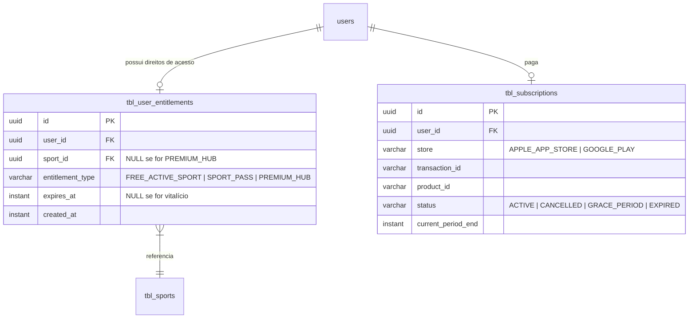

# Plano de Monetização e Estratégia de Assinaturas: Liga dos Palpites

Este documento define a arquitetura comercial, planos, precificação e regras de negócios para a monetização da **Liga dos Palpites** nas lojas **Apple App Store** e **Google Play Store**, respondendo diretamente aos desafios de UX, viabilidade de infraestrutura, modelagem de banco de dados e dinâmica de lojas.

---

## 🎯 1. Estratégia de Seleção de Esporte (Free & Premium)

### Escolher o Esporte no plano "Free" é viável?
**Sim, extremamente viável e altamente recomendado.** 

Ao contrário de prender o usuário a uma liga ou esporte fixo definido pelo administrador, permitir que o usuário selecione seu **Esporte Ativo** durante o onboarding resolve três problemas críticos:
1. **Atração Global**: Usuários que não gostam de futebol (mas amam basquete/NBA ou futebol americano/NFL) podem baixar o aplicativo e utilizá-lo gratuitamente no esporte de sua preferência.
2. **Efeito de Rede Social**: Permite que grupos de amigos joguem qualquer esporte juntos de forma gratuita, impulsionando a viralização orgânica do app.
3. **Gatilho de Conversão Natural**: Se o usuário quer acompanhar futebol *e* basquete ao mesmo tempo, ele atinge o limite do plano gratuito e é incentivado a comprar um **Sport Pass** ou assinar o **Premium Hub**.

### A Regra de Trava (Cooldown de Esporte)
Para evitar que usuários do plano gratuito burlem o sistema trocando de esporte ativo todos os dias (ex: selecionar futebol no domingo, basquete na quarta, NFL na quinta), implementaremos as seguintes regras:
* **Seleção Inicial**: O usuário escolhe seu esporte gratuito no onboarding.
* **Trava de Troca (Lock Period)**: O esporte ativo gratuito fica travado por **30 dias**. 
* **Regra de Término de Temporada**: Se o esporte ativo gratuito selecionado pelo usuário terminar sua temporada oficial (ex: fim da temporada da NFL), o back-end detecta isso e libera uma troca gratuita antecipada imediata.
* **Quebra de Trava**: O usuário pode desbloquear qualquer outro esporte instantaneamente assinando o plano correspondente ou comprando um passe.

---

## ⏱️ 2. Divisão do Live Score (Free vs. Premium)

### Restringir o lance a lance no plano Free é uma experiência ruim?
**Não. Pelo contrário, é um excelente equilíbrio comercial.**

Mostrar apenas o placar básico em tempo real (ex: *"Brasil 2 - 1 França - 75'"*) para usuários gratuitos, mas reservar os detalhes ricos para os assinantes, é um modelo validado por gigantes do mercado esportivo (como o *The Athletic* ou aplicativos de estatísticas). 

Isso não frustra o usuário (ele ainda sabe se está ganhando pontos no palpite), mas cria um forte desejo de upgrade para os entusiastas.

### A Divisão de Funcionalidades de Partida:

| Funcionalidade | Plano Gratuito (Free) | Sport Pass / Premium Hub |
| :--- | :---: | :---: |
| **Placar em Tempo Real (Live Score)** | ✅ Sim | ✅ Sim |
| **Tempo de Jogo (Cronômetro)** | ✅ Sim | ✅ Sim |
| **Status da Partida (Intervalo, Fim, etc.)** | ✅ Sim | ✅ Sim |
| **Eventos do Jogo (Gols e Cartões)** | ✅ Apenas Gols | ✅ Completo (Gols, Cartões, Subs) |
| **Detalhes Lance a Lance (Play-by-Play)** | ❌ Bloqueado | ✅ Sim (Crônica/Comentários ao vivo) |
| **Escalações e Formações Táticas** | ❌ Bloqueado | ✅ Sim (Oficiais e Estatísticas individuais) |
| **Estatísticas Avançadas (Chutes, Posse, xG)** | ❌ Bloqueado | ✅ Sim (Gráficos comparativos) |
| **Simulador de Ranking ao Vivo** | ❌ Bloqueado | ✅ Sim (Ver posição na liga live conforme os gols acontecem) |

---

## 📦 3. Estrutura de Planos e Viabilidade (Mensal, Trimestral e Anual)

Ter opções demais na tela de pagamento gera **Paralisia de Decisão** (o usuário fica em dúvida sobre qual escolher e acaba não comprando nenhuma). O padrão ouro que maximiza o faturamento e a experiência de compra nas lojas de aplicativos é a oferta de **2 opções principais com forte contraste de valor**:

1. **Plano Mensal (Recorrência de Curto Prazo)**: Entrada barata para quem quer apenas testar o app ou acompanhar um torneio rápido (ex: Copa do Mundo ou os Playoffs da NBA).
2. **Plano Anual (LTV Alto com Desconto)**: O plano recomendado. Apresenta uma economia massiva se comparado ao mensal acumulado (geralmente entre 40% e 50% de desconto), garantindo faturamento anual imediato e cobrindo os custos de APIs de esportes no longo prazo.

### E o plano Trimestral (3 meses)?
Ele é viável, mas costuma canibalizar o plano anual sem trazer a facilidade de conversão do plano mensal. Além disso, adiciona uma terceira opção visual no paywall, poluindo o design e aumentando o tempo de hesitação do usuário. Prefira focar em **Mensal vs. Anual**.

---

## 💵 4. Precificação Sugerida (BRL e USD)

Os valores foram reajustados para conferir um posicionamento de mercado mais premium, cobrindo com margem as taxas das lojas (30% no primeiro ano, 15% subsequentes/pequenos desenvolvedores) e o consumo de dados das APIs esportivas.

### Tabela de Preços (Brasil - BRL):

| Produto / Plano | Mensal | Trimestral (Opcional) | Anual (Recomendado) | Benefícios Principais |
| :--- | :--- | :--- | :--- | :--- |
| **Sport Pass (Individual)**<br>*Apenas 1 esporte extra* | R$ 9,90 | R$ 24,90 | R$ 79,90 *(R$ 6,65/mês)* | Remove anúncios no esporte escolhido; Libera lance a lance e estatísticas de jogo completas. |
| **Premium Hub (Completo)**<br>*Todos os esportes e ligas* | R$ 24,90 | R$ 59,90 | R$ 149,90 *(R$ 12,49/mês)* | **Acesso ilimitado** a todos os esportes presentes e futuros; Ad-free completo; Simulador de Ranking ao vivo. |

### Tabela de Preços (Internacional - USD):

| Produto / Plano | Mensal | Trimestral (Opcional) | Anual (Recomendado) |
| :--- | :--- | :--- | :--- |
| **Sport Pass (Individual)** | $ 1.99 | $ 4.99 | $ 14.99 *(~ $ 1.24/mês)* |
| **Premium Hub (Completo)** | $ 4.99 | $ 11.99 | $ 29.99 *(~ $ 2.49/mês)* |

---

## 🔌 5. Estratégia de Cadastro na Apple App Store e Google Play Console

### Preciso adicionar separadamente o valor do esporte extra (Sport Pass) na loja também?
**Sim, obrigatoriamente.** 

Tanto a Apple (App Store Connect) quanto o Google (Google Play Console) **não permitem precificação dinâmica** em um único ID genérico (ex: você não pode mandar o aplicativo decidir cobrar R$ 9,90 para futebol ou R$ 9,90 para basquete dinamicamente sem cadastrá-los). Cada item que pode ser comprado ou assinado deve ter um **Product ID próprio e estático** configurado nos painéis das lojas.

#### Como configurar de forma otimizada para o usuário e o back-end:

A melhor prática de mercado é cadastrar **um produto por esporte específico**. Isso garante que o prompt de compra nativo do sistema operacional do celular exiba claramente o nome do que está sendo comprado (ex: *"Assinar Passe de Basquete"* em vez de *"Assinar Passe Genérico 1"*), gerando mais confiança e menos pedidos de reembolso/cancelamento.

```
com.ligadospalpites
 ├── .premium.monthly  (Assinatura mensal do Premium Hub)
 ├── .premium.yearly   (Assinatura anual do Premium Hub)
 ├── .sportpass.football.monthly  (Assinatura mensal do esporte Futebol)
 ├── .sportpass.basketball.monthly (Assinatura mensal do esporte Basquete)
 └── .sportpass.nfl.monthly        (Assinatura mensal do esporte Futebol Americano)
```

> [!NOTE]
> Cadastrar 3 ou 4 esporte passes leva menos de 15 minutos e é um processo de configuração única. Sempre que você adicionar um novo esporte de destaque na plataforma, basta ir na loja correspondente e registrar o ID associado.

---

## 🗄️ 6. Modelagem de Banco de Dados Detalhada (Backend)

Para unificar o gerenciamento dos acessos **Free**, **Sport Pass** e **Premium Hub**, utilizaremos um modelo de **Entitlements (Direitos de Acesso)**. Todas as permissões de acesso do usuário estarão consolidadas em uma única tabela, facilitando consultas de alto desempenho e simplificando o controle.



### Detalhamento Prático da Tabela `tbl_user_entitlements`

Esta tabela centraliza e resolve todas as variações de planos do usuário de forma uniforme:

1. **Caso 1: Usuário "Free" (Escolha do primeiro esporte no Onboarding)**
   * Quando o usuário finaliza o cadastro e escolhe "Futebol" como seu esporte grátis, o sistema insere o seguinte registro:
     - `entitlement_type`: `"FREE_ACTIVE_SPORT"`
     - `sport_id`: `UUID_DO_FUTEBOL`
     - `expires_at`: `NOW() + 30 DIAS` (Controla o cooldown de troca de esporte gratuito).

2. **Caso 2: Compra de um "Sport Pass" (Esporte Extra avulso)**
   * Se o usuário compra o passe de Basquete por R$ 9,90, o sistema valida a compra na loja e insere/atualiza o registro:
     - `entitlement_type`: `"SPORT_PASS"`
     - `sport_id`: `UUID_DO_BASQUETE`
     - `expires_at`: `FIM_DO_PERIODO_DA_ASSINATURA` (Mensal ou Anual).

3. **Caso 3: Upgrade para o "Premium Hub"**
   * Se o usuário assina o Premium Hub por R$ 24,90/mês, o sistema insere o registro:
     - `entitlement_type`: `"PREMIUM_HUB"`
     - `sport_id`: `NULL` (O campo `NULL` indica liberação irrestrita para todos os esportes presentes e futuros).
     - `expires_at`: `FIM_DO_PERIODO_DA_ASSINATURA`.

---

## 🔒 7. Lógica de Validação de Acesso no Back-end (Spring Boot Security)

Sempre que a aplicação Flutter solicitar informações de partidas, estatísticas ou tabelas para um determinado esporte, o back-end executa a seguinte lógica de validação:

```kotlin
import java.time.Instant
import java.util.UUID

enum class EntitlementType {
    FREE_ACTIVE_SPORT,
    SPORT_PASS,
    PREMIUM_HUB
}

class AccessController(
    private val entitlementRepository: EntitlementRepository
) {

    /**
     * Valida se o usuário tem permissão para acessar os dados e realizar palpites em um esporte.
     */
    fun hasAccessToSport(userId: UUID, sportId: UUID): Boolean {
        val now = Instant.now()
        val entitlements = entitlementRepository.findAllActiveByUserId(userId, now)

        // Regra 1: Premium Hub ativo dá acesso irrestrito a todos os esportes
        if (entitlements.any { it.entitlementType == EntitlementType.PREMIUM_HUB }) {
            return true
        }

        // Regra 2: Verifica se possui um Sport Pass ativo específico para este esporte
        if (entitlements.any { it.entitlementType == EntitlementType.SPORT_PASS && it.sportId == sportId }) {
            return true
        }

        // Regra 3: Verifica se este é o esporte gratuito (Free) ativo selecionado pelo usuário
        if (entitlements.any { it.entitlementType == EntitlementType.FREE_ACTIVE_SPORT && it.sportId == sportId }) {
            return true
        }

        // Se nenhuma regra for satisfeita, o acesso ao esporte está bloqueado
        return false
    }
}
```

### Resposta de Bloqueio Amigável (Fallback):
Se `hasAccessToSport` retornar `false`, o back-end envia um status `403 Forbidden` com um payload contendo o ID do produto para que o aplicativo abra a tela de vendas nativa:

```json
{
  "error": "SPORT_LOCKED",
  "message": "Este esporte não está desbloqueado em sua conta.",
  "unlockedRequiredProductId": "com.ligadospalpites.sportpass.basketball.monthly"
}
```

---

## ⏱️ 8. Período de Degustação (Trial) Recomendado

* **Recomendação**: **7 dias de Trial Gratuito** apenas no plano *Premium Hub Anual*.
* **Por que 7 dias?**
  * O ciclo de engajamento em palpites de esporte é semanal (rodadas de quarta-feira e fim de semana). 
  * Com 7 dias, o usuário consegue experimentar a emoção de palpitar em rodadas completas de múltiplos esportes, ver a sua subida rápida no ranking, receber as notificações ricas de gol no celular e experimentar o simulador de posições ao vivo.
  * Menos que isso (ex: 3 dias) é insuficiente para completar uma rodada inteira. Mais que isso (ex: 14 dias) reduz a urgência de conversão pós-trial.
