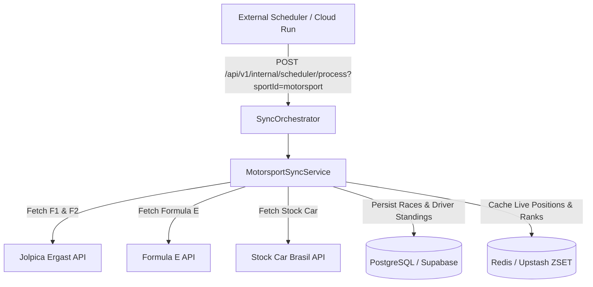

# Product Requirement Document (PRD): Motorsport Integration (F1, F2, Formula E & Stock Car)

## 1. Visão Geral e Objetivo Executivo

O módulo de **Motorsport / Automobilismo** expande a plataforma **Liga dos Palpites** (conforme **[ADR-0006](file:///c:/Users/Vinicius/workspace/ligadospalpites-core/docs/adr/0006-sports-data-sync-engine.md)**) para os fãs de corridas de alta velocidade, cobrindo modalidades internacionais e nacionais de grande audiência: **Fórmula 1**, **Fórmula 2**, **Fórmula E** e **Stock Car Pro Series**.

Como o automobilismo é um esporte individual/construtores sem confronto direto 1x1, este documento define o modelo de palpites dinâmicos (Pole, Vencedor, Pódio), a arquitetura de ingestão de dados e as fontes de APIs abertas e gratuitas.

---

## 2. Estratégia de Provedores Gratuitos por Categoria de Corrida

### 📊 Matriz de Provedores de Dados

| Categoria | Provedor Principal | Endpoint / Fonte | Custo / Restrições | Ativos Visuais (Logos/Banners) |
| :--- | :--- | :--- | :--- | :--- |
| **Fórmula 1 (F1)** | **Jolpica Ergast F1 API** + **OpenF1** | `GET api.jolpi.ca/ergast/f1/current.json` | 🟢 100% Gratuito / Open Source | Banners de Circuitos + TheSportsDB |
| **Fórmula 2 (F2)** | **Jolpica Ergast F2 API** | `GET api.jolpi.ca/ergast/f2/current.json` | 🟢 100% Gratuito | Logos F2 + Capacetes/Pilotos |
| **Fórmula E** | **FIA Formula E JSON API** | `GET fiaformulae.com/api/v1/races` | 🟢 100% Gratuito | Logos e Fotos de Carros Elétricos |
| **Stock Car Pro Series** | **Stock Car Brasil API** / Admin Seed | `GET stockproseries.com.br/api/etapas` / Seed | 🟢 100% Gratuito | Escudos de Equipes e Carros V8 |

---

## 3. Requisitos Funcionais (FRs)

### 3.1. Ingestão de Calendário e Etapas de Corrida
* **FR-MOT-1.1**: O sistema deve sincronizar o calendário de etapas de cada categoria:
  * **Fórmula 1**: 24 Grandes Prêmios (GPs), incluindo treinos livres, Sprint Races, Qualifying e Corrida Principal.
  * **Fórmula 2**: Etapas de apoio do circo da F1.
  * **Fórmula E**: Eprix mundiais (São Paulo, Monaco, Londres, Tokyo).
  * **Stock Car Brasil**: Etapas nacionais (Interlagos, Goiânia, Cascavel, Tarumã, Velocitta).
* **FR-MOT-1.2**: Status da Etapa/GP:
  * `SCHEDULED`: Etapa agendada.
  * `QUALIFYING`: Treino classificatório em andamento (trava palpites de Pole Position).
  * `RACE_IN_PROGRESS`: Corrida em andamento (trava palpites de Vencedor e Pódio).
  * `FINISHED`: Etapa encerrada com classificação final homologada.

### 3.2. Regras de Pontuação de Palpites para Automobilismo
* **FR-MOT-2.1**: A grade de palpites por etapa é composta por 4 seleções:
  1. **Pole Position** (Quem faz o 1º tempo no Qualifying): **10 pontos**.
  2. **Vencedor da Corrida (P1)** (Quem cruza a linha de chegada em 1º): **25 pontos**.
  3. **Pódio Completo (Top 3)** (Quem chega em 1º, 2º e 3º na ordem exata): **50 pontos bônus** (ou 10 pts por piloto no pódio fora de ordem).
  4. **Volta Mais Rápida (*Fastest Lap*)**: **10 pontos bônus**.

### 3.3. Classificação Geral de Pilotos e Construtores
* **FR-MOT-3.1**: O sistema deve sincronizar e exibir a tabela atualizada do Campeonato Mundial de Pilotos e Construtores/Equipes.

---

## 4. Requisitos Não-Funcionais (NFRs)

* **NFR-MOT-1.1 (Caching de Etapas)**: Como os dados de GPs não mudam a cada segundo antes do fim de semana de corrida, o cache local em **Upstash Redis** terá TTL de **6 horas** para calendários e **30 segundos** durante treinos e corridas ao vivo.
* **NFR-MOT-1.2 (BFF Latency)**: A resposta da aba de Motorsport no App Flutter deve ser < **120ms**.

---

## 5. Arquitetura do Motor de Sincronização (`MotorsportSyncService`)

Seguindo a **[ADR-0006](file:///c:/Users/Vinicius/workspace/ligadospalpites-core/docs/adr/0006-sports-data-sync-engine.md)**, o serviço especializado `MotorsportSyncService` gerenciará a ingestão:

### Extensões no Banco de Dados (PostgreSQL):

1. **`tbl_matches` (Campos adaptados para Automobilismo)**:
   - `circuit_name` (VARCHAR): Nome do autódromo (ex: *Autódromo de Interlagos*).
   - `country_code` (VARCHAR): Código do país (ex: `BRA`, `ITA`, `GBR`).
   - `race_type` (VARCHAR): `QUALIFYING`, `SPRINT`, `RACE`.
   - `podium_results_json` (JSONB): `{"p1": "Verstappen", "p2": "Hamilton", "p3": "Norris", "pole": "Verstappen", "fastestLap": "Norris"}`.
