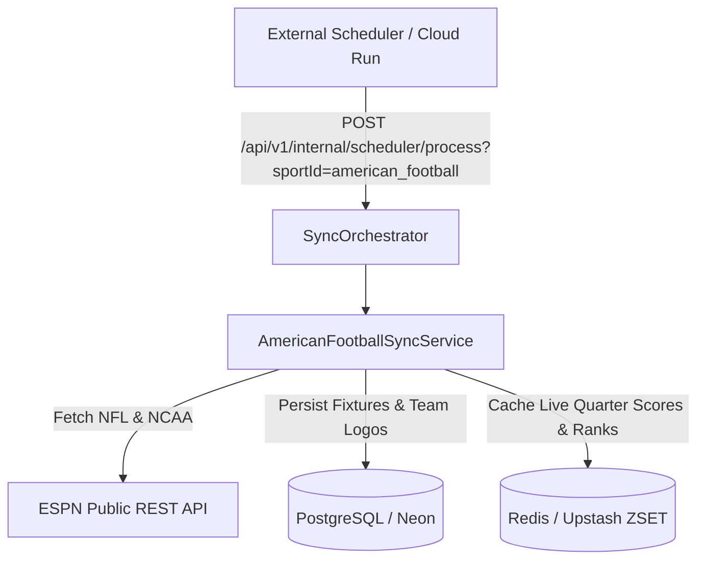

# Product Requirement Document (PRD): American Football Integration (NFL & College Football)

## 1. Visão Geral e Objetivo Executivo

O módulo de **Futebol Americano** expande o aplicativo **Liga dos Palpites** (conforme **[ADR-0006](file:///c:/Users/Vinicius/workspace/ligadospalpites-core/docs/adr/0006-sports-data-sync-engine.md)**) para os entusiastas da **NFL** (National Football League) e do **NCAA College Football**.

Este documento detalha os requisitos da modalidade, as regras de palpites (vencedor, margem de touchdown e placar exato de pontos), e o uso da **API Pública da ESPN** como fonte primária gratuita de dados sem restrições de temporada.

---

## 2. Estratégia de Provedor Gratuito de Dados

### 📊 Provedor de Dados: ESPN Public API

| Competição | Provedor Principal | Endpoint | Custo / Restrições | Ativos Visuais |
| :--- | :--- | :--- | :--- | :--- |
| **NFL** (Temporada Regular, Playoffs, Super Bowl) | **ESPN Public API** | `GET site.api.espn.com/apis/site/v2/sports/football/nfl/scoreboard` | 🟢 100% Gratuito (Sem API Key, Sem limite de temporada) | CDN da ESPN (500x500 PNG) |
| **NCAA Football** (College Football) | **ESPN Public API** | `GET site.api.espn.com/apis/site/v2/sports/football/college-football/scoreboard` | 🟢 100% Gratuito | Logos Universitários HD |

---

## 3. Requisitos Funcionais (FRs)

### 3.1. Ingestão de Jogos e Calendário da NFL
* **FR-NFL-1.1**: O sistema deve sincronizar todas as semanas da NFL:
  * **Preseason** (Jogos de pré-temporada).
  * **Regular Season** (Semanas 1 a 18).
  * **Playoffs** (Wild Card, Divisional Round, Conference Championships).
  * **Super Bowl** (Grande final).
* **FR-NFL-1.2**: Acompanhamento do Status da Partida:
  * `SCHEDULED`: Partida agendada.
  * `IN_PROGRESS`: Partida em andamento com pontuação parcial por quarto (`Q1`, `Q2`, `Q3`, `Q4`, `OVERTIME`).
  * `FINISHED`: Partida finalizada com placar homologado.
* **FR-NFL-1.3**: Armazenamento de Pontuação por Quarto: A pontuação de cada período de jogo deve ser salva para exibição detalhada nos cards do aplicativo.

### 3.2. Regras de Pontuação de Palpites para Futebol Americano
* **FR-NFL-2.1**: A pontuação de palpites é calculada com base na precisão da vitória e saldo de pontos:
  * **Placar Exato de Pontos** (ex: Palpite Chiefs 27 x 24 Eagles, jogo termina 27 x 24): **30 pontos** (Pontuação máxima).
  * **Vencedor Correto + Margem Exata de Touchdown** (ex: Palpite de vitória por 3 pts, jogo termina com diferença de 3 pts): **20 pontos**.
  * **Vencedor Correto + Margem Próxima** (diferença de até 6 pts na margem): **15 pontos**.
  * **Apenas Vencedor Correto**: **10 pontos**.

---

## 4. Requisitos Não-Funcionais (NFRs)

* **NFR-NFL-1.1 (Rate Limit & Caching)**: Requisições da ESPN API devem ser mantidas em cache no **Upstash Redis** (TTL de 60 segundos nos domingos de jogos e 24h em dias de semana).
* **NFR-NFL-1.2 (Resiliência)**: Proteger as chamadas HTTP com **CircuitBreaker** (Resilience4j).

---

## 5. Arquitetura do Motor de Sincronização (`AmericanFootballSyncService`)

Seguindo a **[ADR-0006](file:///c:/Users/Vinicius/workspace/ligadospalpites-core/docs/adr/0006-sports-data-sync-engine.md)**, a sincronização é gerenciada pelo `AmericanFootballSyncService`:

### Entidades do Domínio (PostgreSQL Schema Extensions):

1. **`tbl_matches` (Campos estendidos para NFL)**:
   - `period_scores_json` (JSONB): `{"home": [7, 10, 3, 7], "away": [3, 7, 7, 7]}`.
   - `stadium_name` (VARCHAR): Nome do estádio (ex: *Arrowhead Stadium*).
