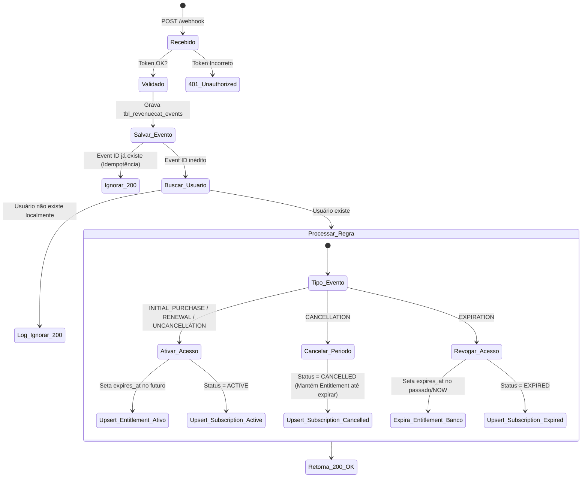

# Spec-0008: Integração de Webhook do RevenueCat (Especificação do Backend)

Esta especificação define a arquitetura, modelos de dados, endpoints REST e lógicas de processamento de regras de negócios no backend Spring Boot para a integração dos eventos de pagamentos e assinaturas do **RevenueCat**.

---

## 1. Modelo de Dados e Migrações (Neon PostgreSQL)

### A. Tabela de Assinaturas (`tbl_subscriptions`)
Mantém o registro operacional e o histórico das assinaturas ativas adquiridas via lojas nativas.

```sql
CREATE TABLE tbl_subscriptions (
    id UUID PRIMARY KEY,
    user_id UUID NOT NULL REFERENCES tbl_users(id) ON DELETE CASCADE,
    store VARCHAR(50) NOT NULL, -- ex: APPLE_APP_STORE, GOOGLE_PLAY, STRIPE
    transaction_id VARCHAR(255) NOT NULL UNIQUE,
    product_id VARCHAR(255) NOT NULL,
    status VARCHAR(50) NOT NULL, -- ex: ACTIVE, CANCELLED, EXPIRED
    current_period_end TIMESTAMP WITH TIME ZONE,
    created_at TIMESTAMP WITH TIME ZONE DEFAULT CURRENT_TIMESTAMP NOT NULL,
    updated_at TIMESTAMP WITH TIME ZONE DEFAULT CURRENT_TIMESTAMP NOT NULL
);

CREATE INDEX idx_subscriptions_user ON tbl_subscriptions(user_id);
```

### B. Tabela de Auditoria de Eventos do Webhook (`tbl_revenuecat_events`)
Garante rastreabilidade total, controle de auditoria e proteção contra processamento duplicado (idempotência).

```sql
CREATE TABLE tbl_revenuecat_events (
    id VARCHAR(100) PRIMARY KEY, -- event.id vindo do RevenueCat
    type VARCHAR(100) NOT NULL, -- event.type (ex: INITIAL_PURCHASE)
    app_user_id VARCHAR(128) NOT NULL,
    product_id VARCHAR(255) NOT NULL,
    payload TEXT NOT NULL, -- JSON bruto completo
    created_at TIMESTAMP WITH TIME ZONE DEFAULT CURRENT_TIMESTAMP NOT NULL
);
```

---

## 2. API REST do Webhook

- **Endpoint**: `POST /api/v1/payments/revenuecat/webhook`
- **Autenticação**: Cabeçalho de autorização estático.
  - Header: `Authorization: Bearer <REVENUECAT_WEBHOOK_SECRET>`
- **Códigos de Resposta**:
  - `200 OK`: Processado com sucesso (ou ignorado por duplicidade/usuário não encontrado para evitar retentativas infinitas do RevenueCat).
  - `401 Unauthorized`: Assinatura/Secret inválido.
  - `500 Internal Server Error`: Erro inesperado de banco ou processamento (força retentativa do RevenueCat).

### Payload de Exemplo (JSON enviado pelo RevenueCat):
```json
{
  "api_version": "1.0",
  "event": {
    "id": "72922180-60b2-4d2c-87d5-ec541818ff3c",
    "type": "INITIAL_PURCHASE",
    "app_user_id": "f5165fe5-2d4e-4f51-b9cf-2b819f7a552e",
    "product_id": "com.ligadospalpites.premium.monthly",
    "entitlement_id": "premium",
    "entitlement_ids": ["premium"],
    "expiration_at_ms": 1781534400000,
    "purchased_at_ms": 1778942400000,
    "store": "PLAY_STORE",
    "environment": "SANDBOX"
  }
}
```

---

## 3. Lógica do State Machine (Processamento dos Eventos)



### Detalhes das Ações:

1. **Idempotência**:
   - O backend executa `springDataRevenueCatEventRepository.existsById(event.id)`. Se for `true`, encerra retornando `200 OK`.
2. **Ativar Acesso**:
   - Mapeia o `entitlement_id` vindo no payload para o respectivo direito local:
     - `"premium"` $\rightarrow$ `EntitlementType.PREMIUM` (com `sportId = null`).
     - `"sport_pass_football"` $\rightarrow$ `EntitlementType.SPORT_PASS` (com `sportId = 'f3b3b44b-6f81-42cb-b1b7-d1a1005a8f4c'`).
   - Verifica se já existe um `UserEntitlement` para aquele `userId`, `entitlementType` e `sportId`.
   - Salva ou atualiza definindo `expires_at` correspondente a `expiration_at_ms`.
   - Atualiza `tbl_subscriptions` com `status = 'ACTIVE'` e `current_period_end` igual a data de expiração.
3. **Cancelar Assinatura (`CANCELLATION`)**:
   - **Nota de Segurança**: Não bloqueamos o acesso do usuário no banco ao receber `CANCELLATION`, pois ele já pagou pelo período atual! Apenas atualizamos o status de sua assinatura em `tbl_subscriptions` para `'CANCELLED'`. O acesso continuará válido até atingir a data já gravada em `expires_at` do entitlement.
4. **Revogar Acesso (`EXPIRATION`)**:
   - Atualiza o registro em `tbl_user_entitlements` definindo o `expires_at` para o horário atual ou do evento (passado), bloqueando o acesso imediatamente.
   - Atualiza `tbl_subscriptions` para `'EXPIRED'`.

---

## 4. Liberação no Spring Security (`SecurityConfig.kt`)

Por padrão, a API do backend protege todos os endpoints com autenticação JWT via claims do Firebase Auth. Para permitir que o webhook do RevenueCat execute suas chamadas externas sem um token JWT de usuário:

- O endpoint `/api/v1/payments/revenuecat/webhook` deve ser configurado como **permitido para todos** (`.permitAll()`) na cadeia de filtros de segurança (`SecurityFilterChain`).
- A proteção desse endpoint passa a ser delegada à camada interna do `RevenueCatWebhookController` que intercepta a requisição e valida a assinatura `Authorization: Bearer <WEBHOOK_SECRET>`.

---

## 5. Validação de Acesso no Controller de Dados (`FixtureController.kt`)

O controller de fixtures e dados esportivos passa a verificar rigorosamente a data de expiração dos direitos ativos:

```kotlin
val now = Instant.now()
val entitlements = entitlementRepository.findByUserId(userUUID)
val hasMultiSport = entitlements.any { entitlement ->
    val isActive = entitlement.expiresAt == null || entitlement.expiresAt.isAfter(now)
    isActive && (
        entitlement.entitlementType == EntitlementType.PREMIUM ||
        (entitlement.entitlementType == EntitlementType.SPORT_PASS && entitlement.sportId == sportId)
    )
}
```
Isso garante o bloqueio imediato e em tempo real de usuários cujas assinaturas já expiraram.
