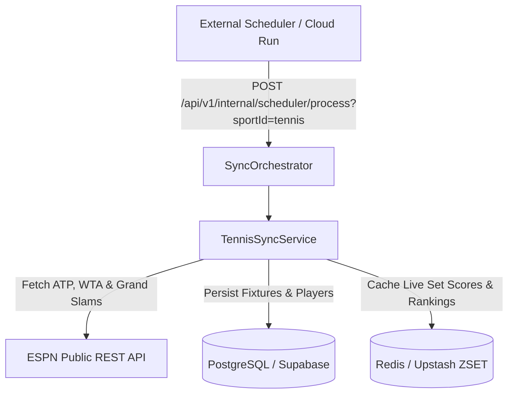

# Product Requirement Document (PRD): Tennis Integration (ATP, WTA & Grand Slams)

## 1. Visão Geral e Objetivo Executivo

O módulo de **Tênis** expande a plataforma **Liga dos Palpites** (conforme **[ADR-0006](file:///c:/Users/Vinicius/workspace/ligadospalpites-core/docs/adr/0006-sports-data-sync-engine.md)**) para os torcedores do circuito mundial de tênis masculino e feminino: **ATP Tour**, **WTA Tour** e os 4 **Grand Slams** (**Australian Open**, **Roland Garros**, **Wimbledon** e **US Open**).

Este documento especifica os requisitos da modalidade, as regras de pontuação de palpites por sets e tiebreaks, e a integração com a **API Pública da ESPN** como fonte primária gratuita de dados.

---

## 2. Estratégia de Provedor Gratuito de Dados

### 📊 Provedor de Dados: ESPN Public API

| Circuito / Torneio | Provedor Principal | Endpoint | Custo / Restrições | Ativos Visuais |
| :--- | :--- | :--- | :--- | :--- |
| **ATP Tour** (Masculino) | **ESPN Public API** | `GET site.api.espn.com/apis/site/v2/sports/tennis/atp/scoreboard` | 🟢 100% Gratuito (Sem API Key) | Fotos dos Tenistas e Bandeiras dos Países |
| **WTA Tour** (Feminino) | **ESPN Public API** | `GET site.api.espn.com/apis/site/v2/sports/tennis/wta/scoreboard` | 🟢 100% Gratuito | Fotos das Tenistas e Bandeiras |
| **Grand Slams** (Wimbledon, US Open, etc.) | **ESPN Public API** | `GET site.api.espn.com/apis/site/v2/sports/tennis/scoreboard` | 🟢 100% Gratuito | Logos Oficiais dos Torneios |

---

## 3. Requisitos Funcionais (FRs)

### 3.1. Ingestão de Torneios e Partidas de Tênis
* **FR-TEN-1.1**: O sistema deve sincronizar as partidas dos torneios ativos da semana no circuito ATP e WTA.
* **FR-TEN-1.2**: Suporte aos Formatos de Partida:
  * **MD3 (Best of 3 Sets)**: Maioria dos torneios ATP/WTA (Vence quem fizer 2 sets primeiro).
  * **MD5 (Best of 5 Sets)**: Grand Slams Masculinos (Vence quem fizer 3 sets primeiro).
* **FR-TEN-1.3**: Status e Placar da Partida:
  * `SCHEDULED`: Partida agendada com horário de quadra.
  * `IN_PROGRESS`: Partida em andamento com placar em tempo real por sets (ex: `6/4, 3/6, 7/6`).
  * `FINISHED`: Partida encerrada com vencedor homologado.
  * `RETIRED` / `WALKOVER`: Desistência de atleta (trata palpites com cancelamento/Devolução).

### 3.2. Regras de Pontuação de Palpites para Tênis
* **FR-TEN-2.1**: Os palpites são calculados pela precisão do placar em sets:
  * **Placar Exato de Sets em MD3** (ex: Palpite Alcaraz 2 x 1 Sinner, jogo termina 2 x 1): **25 pontos** (Pontuação máxima).
  * **Placar Exato de Sets em MD5** (ex: Palpite Djokovic 3 x 1 Medvedev, jogo termina 3 x 1): **30 pontos**.
  * **Vencedor Correto com Placar de Sets Diferente** (ex: Palpitou 2x0 e terminou 2x1): **12 pontos**.

---

## 4. Requisitos Não-Funcionais (NFRs)

* **NFR-TEN-1.1 (Caching)**: Respostas da API da ESPN cacheadas em **Upstash Redis** (TTL de 30 segundos em andamento e 12h em dias normais).
* **NFR-TEN-1.2 (Resiliência)**: **CircuitBreaker** via Resilience4j na camada de sincronização.

---

## 5. Arquitetura do Motor de Sincronização (`TennisSyncService`)

Seguindo a **[ADR-0006](file:///c:/Users/Vinicius/workspace/ligadospalpites-core/docs/adr/0006-sports-data-sync-engine.md)**, a sincronização é gerenciada pelo `TennisSyncService`:

### Entidades do Domínio (PostgreSQL Schema Extensions):

1. **`tbl_matches` (Campos estendidos para Tênis)**:
   - `surface_type` (VARCHAR): `HARD`, `CLAY`, `GRASS`.
   - `set_scores_json` (JSONB): `{"set1": "6-4", "set2": "3-6", "set3": "7-6"}`.
